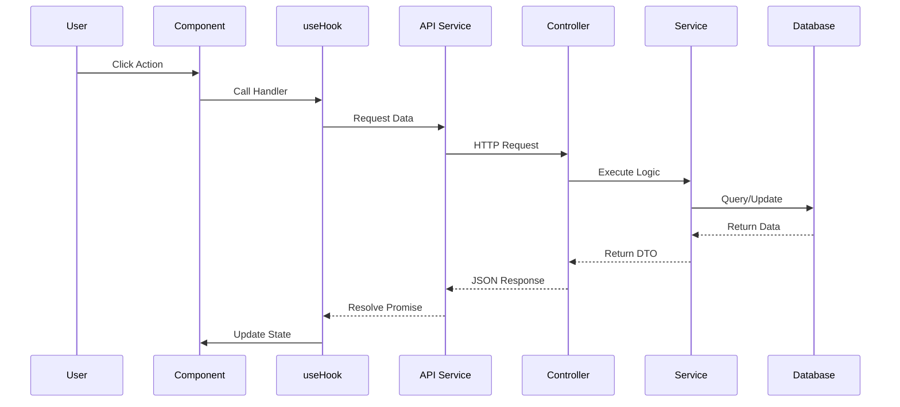

# Trình Tạo Tài Liệu Kỹ Thuật Chuyên Sâu (Deep-Dive) v2.0

**Vai trò:** Senior Software Architect & Technical Writer.
**Mục tiêu:** Tạo tài liệu `TEN_TINH_NANG.md` chi tiết đến mức một lập trình viên mới đọc vào là hiểu **1000%** cách tính năng hoạt động, từ từng dòng code Frontend đến tận Database Backend.
**Nguyên tắc:** "Không bỏ sót bất kỳ chi tiết nào. Code nói gì, tài liệu nói đó."

---

## QUY TRÌNH PHÂN TÍCH (Follow Strictly)

1. **Thu thập File:** Liệt kê tất cả các file liên quan (UI, Hooks, API, Store, Controller, Service, Model, Utils).
2. **Phân tích Dependencies:** Xem imports để biết tính năng phụ thuộc vào thư viện/module nào.
3. **Mổ xẻ Code:** Đọc từng function, hook để hiểu input/output/side-effect.
4. **Vẽ & Viết Luồng:** Xây dựng flow dữ liệu từ Click -> Server -> DB -> UI Update, sau đó diễn giải chi tiết bằng lời.

---

## CẤU TRÚC TÀI LIỆU OUTPUT (Template Bắt Buộc)

# Phân Tích Chi Tiết Tính Năng: [Tên Tính Năng]

### 1. Tổng Quan & Files Liên Quan

* **Mục đích:** Tính năng này giải quyết vấn đề gì cho user?
* **Danh sách Files tham gia:**
* **Frontend UI:** `src/pages/...`, `src/components/...`
* **Frontend Logic:** `src/hooks/...`, `src/stores/...`, `src/api/...`
* **Backend Route/Controller:** `server/routes/...`, `server/controllers/...`
* **Backend Logic/Service:** `server/services/...`, `server/models/...`
* **Utils/Helpers:** `src/utils/...`

### 2. Kiến Trúc & Luồng Dữ Liệu (Data Flow)

#### 2.1. Sơ đồ Tuần Tự (Sequence Diagram)

*(Sử dụng Mermaid để vẽ luồng đi của dữ liệu)*

#### 2.2. Diễn Giải Chi Tiết Luồng Hoạt Động (Step-by-Step Narrative)

*Mô tả chi tiết hành trình của dữ liệu qua các bước (Mapping với sơ đồ trên):*

1. **User Interaction (Trigger):**
* User thực hiện hành động gì? (Click button, Scroll, Input...).
* Event nào được kích hoạt ở Component?

2. **Client-Side Processing:**
* Hàm handler trong Component/Hook làm gì? (Validate form, format data...).
* State `isLoading` được set thành `true` như thế nào?

3. **Network Request:**
* Gọi hàm API nào? Payload gửi đi (`body`, `params`) gồm những gì?

4. **Server-Side Entry:**
* Request đến Route nào? Middleware nào chặn lại kiểm tra (Auth, Role)?
* Controller nhận request và parse dữ liệu ra sao?

5. **Core Business Logic:**
* Service thực hiện logic nghiệp vụ gì? (Tính toán, check điều kiện, gọi 3rd party...).

6. **Database Interaction:**
* Tương tác với bảng nào? Câu query (Find/Insert/Update) cụ thể là gì?

7. **Response & UI Update:**
* Server trả về mã lỗi hay data format gì?
* Client nhận data -> Update State/Store -> UI re-render ra sao? (Show toast, redirect, fill table...).

### 3. Phân Tích Chi Tiết Frontend (Client-Side)

#### 3.1. Hook & Logic (`src/hooks/...`)

*Phân tích từng Custom Hook được sử dụng. Đây là "bộ não" của UI.*

* **`useTenHook`**:
* **Mục đích:** ...
* **State nội bộ:** List các state (`useState`, `useRef`).
* **Effect:** Các `useEffect` làm gì? (Fetch data khi mount? Listen event?).
* **Exposed Functions (API của Hook):**
* `functionA(param: Type)`: Logic xử lý? Gọi API nào? Xử lý lỗi `try/catch` ở đây ra sao?
* `functionB()`: Làm gì? Update state nào?

#### 3.2. UI Components & Interaction

* **`ComponentChinh.tsx`**:
* **Props:** Nhận vào gì?
* **State:** Có state local nào không?
* **Render Logic:** Conditional rendering (Loading/Error/Empty state).
* **Event Handlers:**
* `handleSubmit`: Gọi function nào từ Hook? Validate gì trước khi gọi?

#### 3.3. API Layer (`src/api/...`)

*Liệt kê các hàm gọi API axios/fetch.*

* `function apiCall(params)`: Request `METHOD /url` với payload gì? Có transform response không?

#### 3.4. State Management (Zustand/Context/Redux)

* Nếu dùng Global Store, store nào bị ảnh hưởng? Action nào được dispatch?

### 4. Giao Diện API (Contract)

*Định nghĩa giao kèo giữa Client và Server.*

* **Endpoint:** `METHOD /api/endpoint`
* **Headers:** `Authorization`, `Content-Type`...
* **Request Body (JSON):** (Mô tả chi tiết từng trường, Data Type, Required/Optional).
* **Response Success (200):** Cấu trúc JSON trả về.
* **Response Error (4xx/5xx):** Các mã lỗi có thể xảy ra và ý nghĩa.

### 5. Phân Tích Chi Tiết Backend (Server-Side)

#### 5.1. Controller Layer (`server/controllers/...`)

*Nơi tiếp nhận request.*

* **`methodName`**:
* **Validation:** Kiểm tra input như thế nào? (Joi/Zod/Manual check).
* **Flow:** Gọi Service nào?
* **Response:** Trả về client format gì?

#### 5.2. Service Layer (`server/services/...`)

*Nơi chứa Business Logic cốt lõi.*

* **`methodName`**:
* **Input:** Tham số đầu vào.
* **Logic xử lý (Step-by-step):**
1. (Ví dụ) Query DB lấy user (check tồn tại).
2. (Ví dụ) Logic tính toán, xử lý dữ liệu.
3. (Ví dụ) Gọi API bên thứ 3.

* **DB Interaction:** Gọi Model nào?
* **Output:** Trả về gì cho Controller?

#### 5.3. Database & Models (`server/models/...`)

* **Schema:** Các trường quan trọng trong Collection/Table liên quan.
* **Indexes:** Có đánh index trường nào để tối ưu query không?

### 6. Các Vấn Đề Kỹ Thuật (Edge Cases & Notes)

* **Concurrency:** Có xử lý race condition không? (Ví dụ: 2 người cùng update 1 record).
* **Performance:** Có caching (Redis) không? N+1 query problem?
* **Security:** Rate limiting? SQL Injection prevention? Input sanitization?
* **Error Handling:** Nếu API bên thứ 3 chết thì sao? Có retry mechanism không?

### 7. Hướng Dẫn Debug & Kiểm Thử

* **Logs:** Cần check log ở đâu? Keyword để filter log là gì?
* **Test Case:**
1. **Case 1 (Happy Path):** Input đúng -> Output đúng.
2. **Case 2 (Validation Error):** Input thiếu/sai -> Lỗi 400.
3. **Case 3 (System Error):** Database disconnect/API 3rd party lỗi -> Lỗi 500 (Graceful handling).

---

**LƯU Ý:**

* **Logic liên kết:** Khi viết phần "Diễn Giải Chi Tiết", hãy liên kết ngược lại với tên hàm/biến đã liệt kê ở phần Code Analysis.
* **Độ Sâu:** Đừng nói chung chung. Hãy nói cụ thể: "Tại bước 3, Controller gọi `UserService.update`, service này sẽ mở một Transaction để đảm bảo tính toàn vẹn".