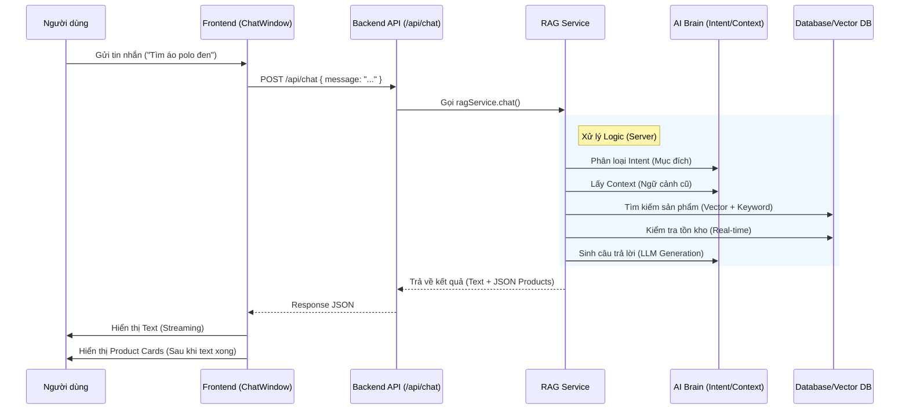

# 🧠 Devenir RAG System Documentation (v3.1)

> **Tài liệu Kỹ thuật Tổng hợp**  
> *Phiên bản: 3.1 (Stable) - Cập nhật: 09/02/2026*

Chào mừng bạn đến với tài liệu kỹ thuật của hệ thống RAG (Retrieval-Augmented Generation) tại Devenir. Tài liệu này được thiết kế để giúp Developer mới nhanh chóng nắm bắt kiến trúc, luồng hoạt động và các component chính của hệ thống.

---

## 1. Tổng Quan Hệ Thống

Hệ thống RAG của Devenir không chỉ là một chatbot thông thường, mà là một **AI-Powered Commerce Engine** phục vụ 2 đối tượng chính:

1.  **Client RAG (Fashion Advisor)**: Trợ lý ảo cho khách hàng.
    *   Tư vấn phối đồ, chọn size.
    *   Tìm kiếm sản phẩm (Text/Image/Voice).
    *   Gợi ý quà tặng thông minh (Gift Intelligence).
2.  **Admin RAG (Business Analyst)**: Trợ lý cho quản trị viên.
    *   Phân tích doanh thu, tồn kho.
    *   Tra cứu thông tin khách hàng.
    *   Tạo báo cáo tự động.

---

## 2. Kiến Trúc & Tech Stack

### 🛠 Tech Stack
*   **Core**: Node.js, Express.js
*   **LLM**: OpenAI GPT-4o-mini (Primary), GPT-4o (Complex tasks).
*   **Databases**:
    *   **MongoDB**: Metadata sản phẩm, Orders, Text Search (Tier 1).
    *   **Pinecone**: Vector Search cho Semantic Product Search (Tier 3).
    *   **Redis**: Semantic Caching & Sticky Context.
*   **Tools**: LangChain (Orchestration), Cohere (Reranking).

### 🏗 Cấu trúc Thư mục (`server/services/rag/`)
```
rag/
├── core/                  # Core logic (RAGService, LLMProvider)
├── retrieval/             # Search logic (Vector, MongoDB Text, Hybrid)
├── generation/            # Prompt templates & Response generation
├── orchestrators/         # Context Manager, Intent Classifier
├── query-transformation/  # Query Expansion, Decomposer
├── specialized/           # Specialized Handlers (Product, Size, Gift)
├── tools/                 # Admin Tools (Analytics, CRM)
└── utils/                 # Helpers (Logger, Cache)
```

---

## 3. Luồng Hoạt Động (The Pipeline)

Khi một User Query được gửi đến, hệ thống xử lý qua 5 bước chính:

### Bước 1: Query Transformation (Biến đổi câu hỏi)
*   **Mục đích**: Hiểu ý định thực sự và làm giàu thông tin.
*   **Xử lý**:
    *   **Expansion**: "quà tặng mẹ" → mở rộng thành "nước hoa, trang sức, khăn choàng".
    *   **Correction**: Sửa lỗi chính tả phím tắt.

### Bước 2: Intent Classification (Phân loại ý định)
Sử dụng cơ chế **Hybrid Classification**:
1.  **Keyword (Ultra-fast)**: Bắt các từ khóa cứng ("mua", "size", "giá"). Độ tin cậy cao.
2.  **LLM (Flexible)**: Xử lý câu hỏi phức tạp hoăc mơ hồ.
*   *Các Intent chính*: `product_advice`, `size_recommendation`, `gift_recommendation`, `order_lookup`.

### Bước 3: Retrieval (Tìm kiếm dữ liệu)
Áp dụng chiến lược **Multi-Tier Search (RAG 3.1)** để tối ưu tốc độ/chính xác:
*   **Tier 1 - Text Search (MongoDB)**: Tìm chính xác tên sản phẩm (~5ms).
*   **Tier 2 - Regex Search**: Tìm theo pattern/viết tắt (~10ms).
*   **Tier 3 - Vector Search (Pinecone)**: Tìm theo ngữ nghĩa/mô tả (~150ms).

### Bước 4: Smart Context Management
Quản lý ngữ cảnh hội thoại thông minh (`EnhancedContextManager`):
*   **Sticky Context**: Nhớ sản phẩm đang thảo luận (ví dụ: đang nói về áo A, hỏi "giá bao nhiêu" -> biết là giá áo A).
*   **Smart Topic Detection**: Tự động phát hiện khi user chuyển chủ đề (ví dụ: đang hỏi size -> chuyển sang mua quà) để reset context, tránh nhầm lẫn.

### Bước 5: Generation (Sinh câu trả lời)
*   **Prompt Engineering**: Sử dụng kỹ thuật CoVe (Chain of Verification).
*   **Gift Intelligence**: Nếu là mua quà, prompt bắt buộc đề xuất 3-5 sản phẩm đa dạng kèm lý do.
*   **Format**: Trả về text + JSON metadata (để Frontend hiển thị Product Cards).

---

## 4. Các Tính Năng Nổi Bật (RAG 3.1)

### 🌟 1. Multi-Tier Product Search
Thay vì lạm dụng Vector Search (chậm & tốn kém), hệ thống ưu tiên tìm kiếm text chính xác trước.
*   **Kết quả**: Giảm 90% độ trễ cho các query tìm tên sản phẩm cụ thể.

### 🎁 2. Gift Shopping Intelligence
Hệ thống "hiểu" nhu cầu mua quà tặng:
*   Tự động mở rộng tìm kiếm sang các danh mục quà tặng (Nước hoa, Phụ kiện...).
*   Đề xuất đa dạng (Cross-category) thay vì chỉ 1 loại sản phẩm.

### 🧠 3. Smart Topic Change
Giải quyết vấn đề "Bot bị ngáo" khi user đổi chủ đề đột ngột.
*   Hệ thống dùng 3 quy tắc (Trigger words, Intent change, Rejection) để phát hiện và làm mới bộ nhớ đệm ngay lập tức.

---

## 5. Hướng Dẫn Debug & Monitor

*   **Logs**: Hệ thống log chi tiết tại `logs/rag-service.log`. Tìm kiếm theo `requestId`.
*   **Fact Checking**: Bật `ENABLE_FACT_CHECKING=true` trong `.env` để kiểm tra tồn kho (Stock) trước khi suggest.
*   **Testing**: Sử dụng UI DevTools hoặc Postman để test từng endpoint `/api/rag/chat`.

---

## 6. Luồng Hoạt Động Chi Tiết (Deep Dive)

Phần này mô tả chi tiết luồng xử lý từ lúc người dùng gửi tin nhắn đến khi hiển thị kết quả, phục vụ cho việc thuyết trình và bảo vệ đồ án.

### 6.1 Tổng Quan Luồng Dữ Liệu



### 6.2 Chi Tiết Từng Bước (Step-by-Step)

#### Giai Đoạn 1: Frontend - Gửi Yêu Cầu (Client Side)

**File xử lý chính:**
*   `client/src/features/chat/hooks/useChat.ts`
*   `client/src/features/chat/api/chatApi.ts`

**Quy trình:**
1.  **User Input:** Người dùng nhập "Tìm áo polo cho nam dưới 500k".
2.  **Optimistic UI:**
    *   App ngay lập tức hiển thị tin nhắn của user lên màn hình.
    *   Hiển thị trạng thái "Đang gõ..." (Typing indicator).
3.  **API Call:**
    *   Hàm `sendMessage` gọi API `POST /api/chat`.
    *   Payload gửi đi:
        ```json
        {
          "message": "Tìm áo polo cho nam dưới 500k",
          "conversation_history": [...] // 5 tin nhắn gần nhất để giữ ngữ cảnh
        }
        ```

#### Giai Đoạn 2: Backend - Xử Lý Logic (Server Side)

**File xử lý chính:**
*   `server/routes/chatRoutes.js`: Nhận request.
*   `server/services/rag/core/RAGService.js`: Bộ não điều phối chính.

**Quy trình chi tiết trong `RAGService.chat()`:**

**Bước 1: Hiểu Ý Định (Understanding)**
*   **Intent Classification:** Hệ thống phân tích xem user muốn gì.
    *   File: `intent-classifier.js`
    *   Input: "Tìm áo polo..."
    *   Output: `intent: 'product_advice'` (Tư vấn sản phẩm).
    *   *Các intent khác:* `size_recommendation` (hỏi size), `order_lookup` (tra đơn).

**Bước 2: Lấy & Xử Lý Ngữ Cảnh (Context Management)**
*   **Context Retrieval:**
    *   File: `enhanced-context-manager.js`
    *   Hệ thống kiểm tra xem user có đang nói về sản phẩm nào trước đó không (Sticky Context).
    *   *Ví dụ:* Nếu trước đó user đang xem áo sơ mi, và giờ hỏi "còn màu khác không", hệ thống sẽ hiểu là đang hỏi về áo sơ mi đó.

**Bước 3: Tìm Kiếm & Lọc Dữ Liệu (Retrieval Strategy)**
Đây là trái tim của RAG (File: `product-advisor.service.js`).
1.  **Query Transformation:** Tách từ khóa ("áo polo", "đen", "< 500k").
2.  **Hybrid Search:**
    *   **Vector Search (Pinecone):** Tìm theo ý nghĩa ("trang trọng", "đi chơi").
    *   **Keyword Search (MongoDB):** Tìm chính xác tên ("Devenir Classic").
3.  **Stock & Price Check (Quan Trọng):**
    *   Hệ thống kiểm tra tồn kho realtime trong Database.
    *   **Loại bỏ ngay** các sản phẩm đã hết hàng (Out of Stock) để trạnh gợi ý sai.

**Bước 4: Sinh Câu Trả Lời (Generation)**
*   LLM (GPT-4o) nhận thông tin sản phẩm tìm được + câu hỏi user.
*   Sinh ra câu trả lời tự nhiên: "Mình tìm thấy mẫu Áo Polo Classic giá 450k phù hợp với bạn..."
*   Tạo danh sách `suggested_products` (JSON) chứa thông tin: Tên, Giá, Ảnh, Link.

#### Giai Đoạn 3: Frontend - Hiển Thị Kết Quả (Rendering)

**File xử lý chính:**
*   `client/src/features/chat/components/ChatMessage.tsx`: Component hiển thị tin nhắn.
*   `client/src/features/chat/components/ChatProductCard.tsx`: Component hiển thị thẻ sản phẩm.

**Cấu trúc dữ liệu trả về từ Server:**
```json
{
  "answer": "Dưới đây là một số mẫu áo polo đen giá tốt...",
  "intent": "product_advice",
  "suggested_products": [
    {
      "name": "Áo Polo Basic",
      "price": 450000,
      "image": "/uploads/polo-black.jpg",
      "inStock": true,
      "slug": "ao-polo-basic"
    }
  ]
}
```

**Cách hiển thị trên Chat UI:**

1.  **Streaming Text:**
    *   Frontend nhận `answer` và hiển thị hiệu ứng gõ chữ (typerwriter effect) cho tự nhiên.
    *   Component: `<StreamingText />`.

2.  **Product Cards (Thẻ Sản Phẩm):**
    *   Sau khi text chạy xong, 1 block các thẻ sản phẩm sẽ hiện ra (`fade-in`).
    *   Mỗi thẻ (`ChatProductCard`) hiển thị:
        *   Hình ảnh (được tối ưu hóa).
        *   Tên sản phẩm.
        *   Giá tiền (Format: 450.000đ).
        *   Nhãn "Hết hàng" (nếu có - tuy nhiên server đã lọc trước bước này).

3.  **Interactive Elements:**
    *   Người dùng click vào Card -> Chuyển hướng sang trang chi tiết sản phẩm (`/product-detail`).
    *   Có thể có nút "Thêm vào giỏ" nhanh ngay trong chat (nếu được cấu hình).

### 6.3 Điểm Nhấn Công Nghệ (Technical Highlights)

1.  **Hybrid Search:** Kết hợp cả tìm kiếm từ khóa (chính xác) và Vector (hiểu ý nghĩa) giúp kết quả cực kỳ chính xác.
2.  **Real-time Inventory Check:** Khác với ChatGPT thông thường, hệ thống này kết nối trực tiếp với Database kho hàng, đảm bảo **không bao giờ** gợi ý đồ hết hàng.
3.  **Context-Aware:** Bot nhớ được hội thoại trước. Hỏi "nó giá bao nhiêu" sẽ tự hiểu "nó" là sản phẩm vừa nhắn.
4.  **Optimized UX:** Sử dụng Streaming text và Lazy loading ảnh giúp cảm giác phản hồi tức thì, mượt mà như app native.

---
*Tài liệu này dùng cho mục đích nội bộ của team Development.*
