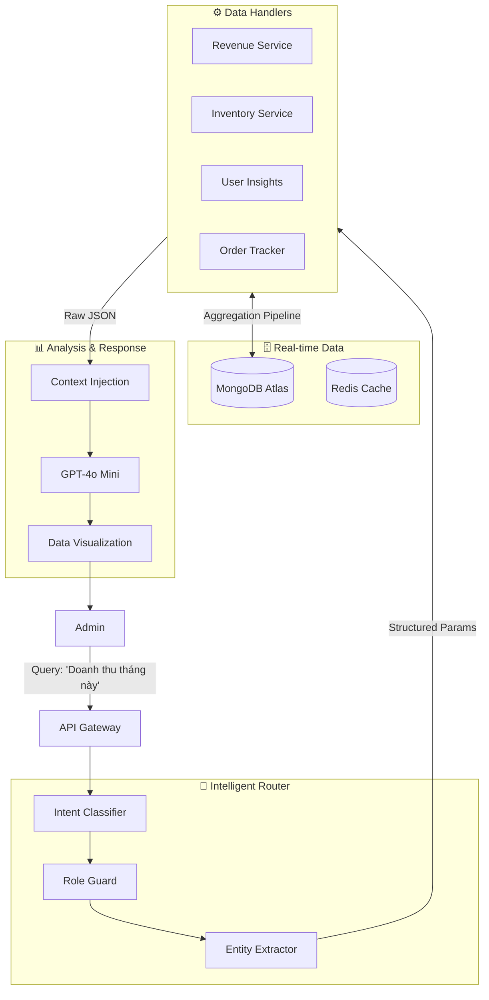

# 🧠 Admin RAG Documentation: Operational Intelligence System

> **Tài liệu kỹ thuật Hệ thống RAG Quản trị Doanh nghiệp (Operational Intelligence)**
> *Last updated: 2026-02-04*

Tài liệu này mô tả kiến trúc, quy trình hoạt động và luồng mã nguồn chi tiết của **Admin RAG** - hệ thống AI hỗ trợ vận hành dành cho quản trị viên.

---

## 1. 🏗️ Kiến trúc Hệ thống (System Architecture)

Hệ thống Admin RAG được thiết kế theo mô hình **Tool-Use Agent** (khác với Retrieval-Based của Client), trong đó LLM đóng vai trò như một bộ điều khiển (Controller) để gọi các API nội bộ.

### Sơ đồ High-Level


---

## 2. ⚡ Cơ chế hoạt động: Text-to-Query Pipeline

Quy trình xử lý một câu lệnh từ Admin đi qua **4 tầng xử lý** (4-Layer Pipeline) để đảm bảo tính chính xác tuyệt đối của số liệu.

### Tầng 1: Phân loại & Bảo mật (Intent & Security)
*   **Module:** `intent-classifier.js` & `admin-analytics.service.js`
*   **Input:** "Doanh thu tuần này bao nhiêu?"
*   **Logic:**
    1.  **Role Verification:** Kiểm tra `user.role === 'admin'`. Từ chối yêu cầu nếu là user thường.
    2.  **Intent Mapping:** Sử dụng `quickIntentDetection` (Keyword matching) cho độ trễ thấp nhất. Mapping từ khóa:
        *   `doanh thu`, `tiền` -> `revenue`
        *   `kho`, `hết hàng` -> `product_inventory`
        *   `user`, `khách` -> `customer_lookup`
    3.  **Entity Extraction (Mini-LLM):** Trích xuất tham số thời gian và đối tượng.
        *   *"tuần này"* -> `{ period: 'this_week', startDate: '2023-10-23...', endDate: '...' }`
        *   *"áo khoác"* -> `{ product_name: 'áo khoác' }`

### Tầng 2: Data Retrieval & Aggregation (Lõi xử lý)
Khác với Client RAG (dùng Vector Search), Admin RAG sử dụng **Native MongoDB Aggregations** để tính toán realtime.

| Intent Type | Kỹ thuật DB Query | Tại sao? |
| :--- | :--- | :--- |
| **Revenue** | `Order.aggregate([{ $match }, { $group: sum }])` | Cần tính tổng chính xác trên hàng triệu record, Vector DB không làm được toán học. |
| **Inventory** | `ProductVariant.find({ quantity: { $lte: threshold } })` | Scanner quét toàn bộ kho để tìm rủi ro tồn kho (Low Stock). |
| **Customer** | Regex Search trên `name`, `email`, `phone` | Tìm kiếm chính xác (Exact/Fuzzy Match) thay vì tìm kiếm ngữ nghĩa (Semantic). |
| **Order** | Index Scan trên `orderNumber` | Lookup `O(1)` cực nhanh. |

### Tầng 3: Context Injection (Kỹ thuật Prompt Engineering)
Dữ liệu thô từ DB (Raw JSON) được "tiêm" (inject) vào System Prompt để LLM đọc hiểu.

*   **Prompt Template:**
    ```text
    Bạn là Admin Assistant. Dưới đây là số liệu thực tế từ Database:
    [DATA_START]
    {
      "totalRevenue": 150000000,
      "orderCount": 50,
      "period": "this_month"
    }
    [DATA_END]
    
    Hãy phân tích số liệu trên. Nếu doanh thu thấp, hãy cảnh báo. 
    Định dạng tiền tệ: VNĐ.
    ```
*   **Mục đích:** LLM không tự "nghĩ" ra số liệu (hallucination), mà chỉ đóng vai trò **Narrator (Người kể chuyện)** dựa trên hard-data được cung cấp.

### Tầng 4: Phản hồi & Export
*   **Text Response:** Câu trả lời tự nhiên.
*   **Actionable Widget:** Nếu user hỏi "xuất báo cáo", hệ thống trả về `suggested_action: { type: 'open_url', url: '...' }` để tải file CSV.

---

## 3. 🛡️ Chiến lược đảm bảo Độ chính xác (Accuracy Strategy)

Tại sao Admin RAG **KHÔNG** dùng Vector Database như Client?

1.  **Vấn đề của Vector DB**: Vector Search là tìm kiếm "gần đúng" (Approximate Nearest Neighbor). Admin cần số liệu "chính xác 100%".
    *   *Ví dụ:* User hỏi "Doanh thu hôm qua", Vector DB có thể trả về một document cũ có chữ "hôm qua". Sai hoàn toàn.
2.  **Giải pháp của Devenir**: **Function Calling / Tool Use**.
    *   AI hiểu ý định -> Gọi hàm code (`getRevenue()`) -> Hàm chạy Query SQL/NoSQL -> Trả kết quả.
    *   Đảm bảo: $1 + 1 = 2$ (Toán học), không phải $1 + 1 \approx 2$ (Ngôn ngữ).

---

## 4. 🚀 Tối ưu hiệu năng (Performance Optimization)

1.  **Parallel Execution:**
    *   Khi tính doanh thu, hệ thống chạy song song 3 queries: (1) Tổng doanh thu, (2) Số đơn hàng, (3) Top sản phẩm bán chạy. Sử dụng `Promise.all()`.
2.  **Smart Date Parsing:**
    *   Thay vì bắt User nhập "2023-10-01", AI tự hiểu "tháng trước", "đầu năm nay" và convert sang khung giờ ISO chuẩn múi giờ Việt Nam (UTC+7).
3.  **Low-Latency Intent:**
    *   Sử dụng regex keywords (Rule-based) trước khi gọi LLM. Nếu khớp keyword -> By-pass LLM phân loại -> Tiết kiệm ~1s độ trễ.

---

## 6. 💻 Code-Level Walkthrough (Trace Chi Tiết)

Phần này mô tả luồng thực thi code từ Frontend Admin Dashboard xuống Database khi Admin thực hiện truy vấn.

### Phase 1: Admin Frontend Layer
Admin nhập: *"Doanh thu hôm qua"*

1.  **UI Component**: `admin/src/components/assistant/ChatWindow.tsx`
    *   Bắt sự kiện gửi tin nhắn.
    *   Gọi `adminChatApi.sendMessage(message)`.
    *   Route API khác biệt: `/api/rag/admin-chat` (Tách biệt hoàn toàn với Client API để bảo mật).

### Phase 2: Security & Routing Layer
Request đến Server Node.js:

2.  **Route Definition**: `server/routes/admin/ragRoutes.js`
    *   Middleware `protect`: Kiểm tra JWT Token.
    *   Middleware `adminOnly`: **Critical Step** - Kiểm tra `if (req.user.role !== 'admin') throw Error`.
    *   Controller: `AdminRagController.chat`.

### Phase 3: Specialized Admin Orchestrator
Không đi qua `RAGService.js` chung, mà đi thẳng vào Service chuyên biệt để tối ưu Security.

3.  **Main Service**: `server/services/rag/specialized/admin-analytics.service.js`
    *   Hàm `handleAdminQuery(userId, query)`:
    *   **Intent Detection**: Gọi `classifyAdminIntent()` dùng LLM (GPT-4o Mini) để hiểu query.
        *   *Input:* "Doanh thu hôm qua"
        *   *Output JSON:* `{ intent: 'revenue', period: 'yesterday' }`

### Phase 4: Data Handlers (Native Query Execution)
Dựa vào Intent JSON, switch-case gọi hàm xử lý dữ liệu.

*Trường hợp: Intent = 'revenue'*

4.  **Revenue Handler**: Hàm `getRevenueData(params)` trong cùng file service.
    *   **Step 4.1 - Date Calculation**: Convert `period: 'yesterday'` thành `startDate` (00:00 hôm qua) và `endDate` (23:59 hôm qua).
    *   **Step 4.2 - Aggregation Pipeline**:
        ```javascript
        await Order.aggregate([
            { $match: { 
                createdAt: { $gte: start, $lte: end }, 
                status: { $in: ['paid', 'delivered'] } 
            }},
            { $group: { _id: null, total: { $sum: "$totalPrice" } } }
        ]);
        ```
    *   **Step 4.3 - Top Products**: Chạy thêm query group by `orderItems.product` để tìm sản phẩm bán chạy nhất hôm qua.

*Trường hợp: Intent = 'product_inventory'* (User hỏi: "Check kho áo sơ mi")
    *   Query MongoDB: `Product.find({ name: /áo sơ mi/i }).populate('variants')`.
    *   Logic JS: Loop qua variants, tính tổng quantity.

### Phase 5: Response Generation (Reporting)
Dữ liệu thô từ DB -> Báo cáo dễ đọc.

5.  **Context Injection**:
    *   Chuẩn bị prompt: "Bạn là trợ lý ảo, đây là dữ liệu: Doanh thu = 15,000,000 VNĐ...".
    *   Gọi `llmProvider.chatCompletion()`.
6.  **Final Return**:
    *   Trả về JSON cho Frontend hiển thị (Text + Biểu đồ nếu có).

---

## 7. Mở rộng Tương lai (Roadmap)

*   **Anomaly Detection:** AI tự động quét log và cảnh báo nếu doanh thu tụt giảm bất thường (không cần Admin hỏi).
*   **Predictive Analytics:** Dùng dữ liệu lịch sử để dự báo doanh thu tháng tới (Linear Regression).
*   **Voice Interface:** Cho phép Admin hỏi bằng giọng nói "Doanh thu hôm nay sao rồi?" khi đang di chuyển.
