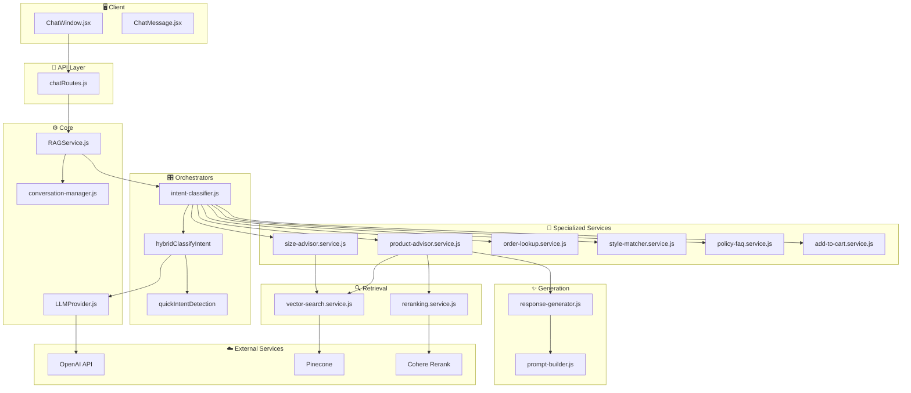

# RAG System Workflow - Devenir Fashion AI

Tài liệu này mô tả chi tiết workflow của hệ thống RAG (Retrieval-Augmented Generation) để tư vấn sản phẩm, size và hỗ trợ khách hàng.

---

## Kiến trúc Tổng quan



---

## Luồng xử lý chi tiết

### 1️⃣ User gửi tin nhắn

```
User: "tìm áo polo màu trắng"
     ↓
ChatWindow.jsx → POST /api/chat
     ↓
chatRoutes.js → RAGService.chat(userId, message, history)
```

### 2️⃣ Phân loại Intent (Hybrid Approach)

```javascript
// intent-classifier.js
hybridClassifyIntent(message, conversationHistory)
     ↓
1. quickIntentDetection() - Keyword-based (fast)
   - "policy_faq" + confidence >= 0.7 → Return immediately
   - "add_to_cart" + confidence >= 0.8 → Return immediately
     ↓
2. classifyIntent() - LLM-based (accurate)
   - Uses conversation history for context
   - Returns JSON: { intent, confidence, extracted_info }
     ↓
3. Compare & decide
   - If LLM confidence < 0.6 → Use keyword result
   - Otherwise → Use LLM result
```

**Intent Types:**

| Intent | Mô tả | Trigger Keywords |
|--------|-------|------------------|
| `product_advice` | Tư vấn sản phẩm | tìm, muốn, cần, gợi ý, sản phẩm |
| `size_recommendation` | Tư vấn size | size, chiều cao, cân nặng, form |
| `style_matching` | Phối đồ | phối, mix, match, outfit |
| `order_lookup` | Tra cứu đơn hàng | đơn hàng, tracking, theo dõi |
| `policy_faq` | Chính sách | payment, shipping, đổi trả |
| `add_to_cart` | Thêm vào giỏ | thêm vào bag, add to cart, mua |
| `general` | Chung | (fallback) |

### 3️⃣ Parallel Processing

```javascript
// RAGService.js - Tối ưu performance
const [intentResult, context] = await Promise.all([
    hybridClassifyIntent(message, conversationHistory),
    conversationManager.getContext(userId, conversationHistory)
]);
```

### 4️⃣ Route đến Service phù hợp

```javascript
// RAGService.js
switch (intent) {
    case 'product_advice':    → productAdvice(message, context)
    case 'size_recommendation': → sizeRecommendation(message, extracted_info, context)
    case 'style_matching':    → styleMatcher(message, context)
    case 'order_lookup':      → orderLookup(message, extracted_info, userId)
    case 'policy_faq':        → policyFAQ(message, extracted_info)
    case 'add_to_cart':       → handleAddToCart(message, extracted_info, context)
    default:                  → General help message
}
```

---

## Chi tiết từng Module

### 📁 **core/**

| File | Chức năng |
|------|-----------|
| `RAGService.js` | Entry point - điều phối toàn bộ flow, parallel processing |
| `VectorStore.js` | Kết nối Pinecone vector database |
| `LLMProvider.js` | Wrapper cho OpenAI API với các methods: `chatCompletion()`, `jsonCompletion()`, `fastCompletion()`, `embed()` |

**LLMProvider Methods:**

```javascript
// Chat completion (GPT-4o-mini)
await llmProvider.chatCompletion(messages, { temperature: 0.3, maxTokens: 800 })

// JSON response (fast model)
await llmProvider.jsonCompletion(messages, { temperature: 0.1 })

// Embeddings (3-small, 1536 dimensions)
await llmProvider.embed(text)
await llmProvider.embedBatch(texts)
```

---

### 📁 **orchestrators/**

| File | Chức năng |
|------|-----------|
| `intent-classifier.js` | Hybrid classification: Keyword fallback + LLM |
| `conversation-manager.js` | Quản lý context hội thoại, lưu ChatLog vào MongoDB |

**Keyword-based Intent Detection:**

```javascript
quickIntentDetection(message)
// Returns: { intent: 'product_advice', confidence: 0.6 }

// Priority keywords (bypass LLM):
- policy_faq: payment, shipping, crypto, payos, nowpayments
- add_to_cart: thêm vào bag, add to cart, mua ngay
```

---

### 📁 **specialized/**

#### 1. `product-advisor.service.js`

**Flow: Vector Search → Color Filter → Rerank → Generate**

```javascript
async productAdvice(query, context) {
    // 1. Enrich short queries with conversation context
    // 2. Vector search (Pinecone, topK: 50)
    // 3. Color detection (VI → EN mapping)
    // 4. MongoDB query for color variants
    // 5. Rerank với Cohere (dùng **Enriched Query** để giữ context sản phẩm, top 10)
    // 6. Build context text
    // 7. Generate response (OpenAI)
    // 8. Return: { answer, sources, suggested_products }
}
```

**Color Detection:**

```javascript
// Vietnamese → English mapping
VI_TO_EN_COLORS = {
    'trắng': 'white',
    'đen': 'black',
    'đỏ rượu': 'wine red',
    ...
}

// Compound colors support
COMPOUND_COLORS = ['wine red', 'navy blue', 'dusty pink', ...]
```

#### 2. `size-advisor.service.js`

**Flow: Product Lookup → Size Chart → LLM Recommendation**

```javascript
async sizeRecommendation(query, extractedInfo, context) {
    // 1. Get product from context or vector search
    // 2. Check Free Size / One Size
    // 3. Build size chart prompt
    // 4. LLM generates recommendation (JSON)
    // 5. Return: { answer, size_recommendation, suggested_action }
}
```

**Size Chart (Hardcoded):**

```
XS:   < 1m60, < 50kg
S:    1m60 - 1m65, 50 - 60kg
M:    1m65 - 1m70, 60 - 70kg
L:    1m70 - 1m75, 70 - 80kg
XL:   1m75 - 1m80, 80 - 90kg
XXL:  1m80 - 1m85, 90 - 100kg
```

**Suggested Action (Add to Cart Button):**

```javascript
suggested_action: {
    type: 'add_to_cart',
    prompt: 'Bạn có muốn thêm sản phẩm này vào giỏ hàng không?',
    product: { _id, name, variantId, mainImage, price },
    variant_id: '...'
}
```

#### 3. `order-lookup.service.js`

**Flow: Query Classification → Order Search → Format Response**

```javascript
async orderLookup(query, extractedInfo, userId) {
    // 1. LLM classify query type: list_all | specific | latest
    // 2. Route to handler:
    //    - list_all → handleListAllOrders(userId)
    //    - latest → handleLatestOrder(userId)
    //    - specific → handleSpecificOrder({ order_number, phone, email })
    // 3. Format order details with status translation
}
```

**Order Status Translation:**

```javascript
statusMap = {
    'pending': 'Chờ thanh toán',
    'paid': 'Đã thanh toán',
    'shipped': 'Đang giao hàng',
    'delivered': 'Đã giao thành công',
    'cancelled': 'Đã hủy'
}
```

#### 4. `policy-faq.service.js`

**Flow: Keyword Detection → Static Response**

```javascript
async policyFAQ(query, extractedInfo) {
    // No LLM needed - uses hardcoded policy info
    
    PAYMENT_INFO = {
        methods: ['PayOS', 'NowPayments (Crypto)']
    }
    
    SHIPPING_INFO = {
        options: [
            { name: 'Standard', price: 'FREE', time: '2-3 ngày' },
            { name: 'Next day', price: '$5', time: '1 ngày' },
            { name: 'Nominated', price: '$10', time: 'Chọn ngày' }
        ]
    }
    
    RETURN_POLICY = {
        period: '30 ngày',
        conditions: ['Chưa sử dụng', 'Còn tag', 'Có hóa đơn']
    }
}
```

#### 5. `style-matcher.service.js`

Gợi ý phối đồ theo style/dịp.

#### 6. `add-to-cart.service.js`

**Flow: Context Extraction → Product Lookup → Confirmation**

```javascript
async handleAddToCart(query, extractedInfo, context) {
    // 1. Find product from conversation context (regex: **ProductName**)
    // 2. Fallback to vector search
    // 3. Get first available variant
    // 4. Return suggested_action for confirmation
}
```

---

### 📁 **retrieval/**

| File | Chức năng |
|------|-----------|
| `vector-search.service.js` | Pinecone vector similarity search |
| `reranking.service.js` | Cohere Rerank API |

**Vector Search:**

```javascript
searchProducts(query, { topK: 50 })
// → Pinecone query with embedding
// → Returns: [{ id, score, metadata: { product_id, product_name, proposition_text } }]
```

**Reranking:**

```javascript
rerankDocuments(query, documents, topN = 10)
// → Cohere rerank-multilingual-v3.0
// → Returns: [{ index, relevance_score }]
```

---

### 📁 **generation/**

| File | Chức năng |
|------|-----------|
| `prompt-builder.js` | Xây dựng prompts cho các use cases |
| `response-generator.js` | Gọi LLMProvider để generate |

**CoVe Prompt (Chain of Verification):**

```javascript
buildCoVePrompt(context, conversationHistory)
// Quy tắc:
// - CHỈ sử dụng thông tin từ [Context]
// - KHÔNG bịa đặt
// - KHÔNG emoji
// - Giá dạng $XXX
// - Dùng **bold** cho tên sản phẩm
```

---

### 📁 **embeddings/**

| File | Chức năng |
|------|-----------|
| `embedding.service.js` | OpenAI embeddings (text-embedding-3-small) |
| `proposition.service.js` | Chia product info thành chunks |

---

## Example Flows

### Flow 1: Tư vấn Sản phẩm

```
User: "tìm áo polo màu wine red"
     ↓
1. hybridClassifyIntent → "product_advice" (confidence: 0.8)
     ↓
2. productAdvice():
   2a. searchProducts("tìm áo polo màu wine red", topK: 50)
   2b. findColorInQuery() → { vi: "wine red", en: "wine red" }
   2c. MongoDB: ProductVariant.find({ color: /wine red/i })
   2d. rerankDocuments(query, propositions, top: 10)
   2e. Build context with color-matched products first
   2f. generateResponse(query, context)
     ↓
3. Response:
   {
     answer: "Dạ có bạn, mình có **Cotton Polo Shirt** màu Wine Red...",
     sources: [...],
     suggested_products: [{_id, name, variantId, mainImage, price}]
   }
```

### Flow 2: Tư vấn Size

```
User: "size M có vừa không, cao 1m70 nặng 65kg"
     ↓
1. hybridClassifyIntent → "size_recommendation"
   extracted_info: { height: 170, weight: 65 }
     ↓
2. sizeRecommendation():
   2a. Get product from context or search
   2b. Check Free Size → If yes, return immediately
   2c. Build prompt with size chart
   2d. LLM → JSON: { recommended_size: "M", reason: "..." }
   2e. Get variants of recommended size
     ↓
3. Response với suggested_action:
   {
     answer: "Với chiều cao 1m70 và cân nặng 65kg, size M sẽ vừa...",
     suggested_action: {
       type: "add_to_cart",
       variant_id: "...",
       product: {...}
     }
   }
     ↓
4. Client renders "Có, thêm vào giỏ" / "Không, cảm ơn" buttons
```

### Flow 3: Tra cứu Đơn hàng

```
User: "đơn hàng của tôi"
     ↓
1. hybridClassifyIntent → "order_lookup"
     ↓
2. orderLookup(query, extractedInfo, userId):
   2a. LLM classify → "list_all"
   2b. Check userId (logged in)
   2c. handleListAllOrders(userId)
   2d. Order.find({ user: userId }).sort({ createdAt: -1 }).limit(5)
     ↓
3. Response:
   {
     answer: "Đây là 5 đơn hàng gần nhất của bạn:\n\n1. #AB12CD34...",
     orders: [...]
   }
```

### Flow 4: Policy FAQ

```
User: "thanh toán bằng crypto được không"
     ↓
1. quickIntentDetection → "policy_faq" (confidence: 0.8)
   ⚡ Bypass LLM (high-confidence keyword match)
     ↓
2. policyFAQ():
   - isPaymentQuery = true (keyword: "crypto")
   - Return hardcoded payment info
     ↓
3. Response:
   {
     answer: "**Phương thức thanh toán tại DEVENIR:**\n\n1. PayOS...\n2. NowPayments..."
   }
```

---

## Client-side Integration

```javascript
// ChatWindow.jsx
handleSendMessage(message)
     ↓
sendChatMessage(message, conversationHistory)
     ↓
Receive response: { intent, answer, suggested_action, suggested_products }
     ↓
ChatMessage.jsx
     ↓
// Render answer with markdown
// Render product cards if suggested_products
// Render action buttons if suggested_action
     ↓
handleYesClick() → useAddToCart(variantId, quantity)
```

---

## Performance Optimizations

1. **Parallel Processing**: Intent classification + Context retrieval run in parallel
2. **Keyword Bypass**: High-confidence keywords skip LLM classification
3. **Color Cache**: Database colors cached for 1 hour
4. **Query Enrichment**: Short queries enriched with conversation context
5. **Selective Fields**: MongoDB queries use `.select()` for only needed fields

---

## Models Used

| Purpose | Model | Provider |
|---------|-------|----------|
| Chat Generation | gpt-4o-mini | OpenAI |
| Intent Classification | gpt-4o-mini (fast) | OpenAI |
| Embeddings | text-embedding-3-small | OpenAI |
| Reranking | rerank-multilingual-v3.0 | Cohere |
| Vector Database | Pinecone | Pinecone |
