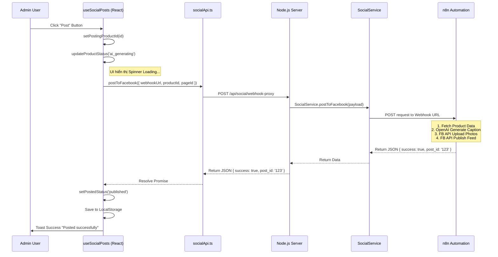

# Phân Tích Chi Tiết Tính Năng: [Đăng Sản Phẩm lên Facebook]

### 1. Tổng Quan & Files Liên Quan
*   **Mục đích:** Giúp Admin chọn sản phẩm để tự động đăng lên Fanpage Facebook. Hệ thống sử dụng AI (thông qua n8n) để tạo caption và xử lý ảnh, giảm thiểu thao tác thủ công.
*   **Danh sách Files tham gia:**
    *   **Frontend UI:** 
        *   `admin/src/pages/content/SocialPostsPage.tsx`: Trang chính.
        *   `admin/src/features/social-posts/components/SocialPostList.tsx`: Hiển thị danh sách & nút Post.
        *   `admin/src/features/social-posts/components/SocialPostGrid.tsx`: Hiển thị lưới (nếu có switch view).
    *   **Frontend Logic:** 
        *   `admin/src/features/social-posts/hooks/useSocialPosts.ts`: Hook chính xử lý logic đăng bài.
        *   `admin/src/features/social-posts/hooks/useSocialSettings.ts`: Hook quản lý cấu hình (Webhook/PageId).
        *   `admin/src/features/social-posts/api/socialApi.ts`: Client API layer.
    *   **Backend Route/Controller:** 
        *   `server/routes/socialRoutes.js`: Định nghĩa route API.
        *   `server/controllers/SocialController.js`: Xử lý request HTTP.
    *   **Backend Logic/Service:** 
        *   `server/services/SocialService.js`: Logic gọi n8n webhook.
    *   **External:**
        *   n8n Webhook: Xử lý quy trình nghiệp vụ (AI Caption, FB API).

### 2. Kiến Trúc & Luồng Dữ Liệu (Data Flow)
*   **Sơ đồ Mermaid Sequence Chi Tiết:**



### 3. Phân Tích Chi Tiết Frontend (Client-Side)

#### 3.1. Hook & Logic (`src/features/social-posts/hooks`)

*   **`useSocialSettings.ts`**:
    *   **Mục đích:** Quản lý Webhook URL và Page ID, lưu trong LocalStorage để không phải nhập lại.
    *   **State nội bộ:**
        *   `settings`: `{ webhookUrl: string, pageId: string }`
        *   `isSettingsOpen`: boolean (điều khiển modal settings)
    *   **Effect:** `useEffect` load `social_settings` từ LocalStorage khi mount.
    *   **Exposed Functions:**
        *   `saveSettings(newSettings)`: Validate input, lưu vào state & LocalStorage, đóng modal.
        *   `isConfigured`: Boolean, trả về true nếu đã có đủ URL và ID.

*   **`useSocialPosts.ts`**:
    *   **Mục đích:** Quản lý trạng thái đăng bài của từng sản phẩm.
    *   **State nội bộ:**
        *   `postedProducts`: Mảng `PostedProduct[]` (lưu lịch sử bài đăng).
        *   `postingProductId`: String | null (lưu ID sản phẩm đang xử lý để hiện loading).
    *   **Effect:** `useEffect` load `social_posted_products` từ LocalStorage khi mount.
    *   **Exposed Functions:**
        *   `handlePost(productId)`: 
            1.  Kiểm tra `isConfigured` (từ settings).
            2.  Set state `postingProductId`.
            3.  Update status local -> `ai_generating`.
            4.  Gọi `socialApi.postToFacebook`.
            5.  Nếu thành công: Update status -> `published`, tạo fake metrics (demo), lưu LocalStorage.
            6.  Nếu lỗi: Update status -> `failed`, hiện Toast Error.
        *   `getProductStatus(id)`: Trả về `draft` | `ai_generating` | `published` | `failed`.

#### 3.2. UI Components & Interaction

*   **`SocialPostList.tsx`**:
    *   **Props:** `products` (danh sách lấy từ React Query), `onPost` (hàm handlePost từ hook).
    *   **Render Logic:** Duyệt qua danh sách sản phẩm, gọi hàm `getProductStatus` để quyết định hiển thị nút "Post" hay badge "Published".
    *   **Event Handlers:** Button `onClick` gọi `onPost(product._id)`.

#### 3.3. API Layer (`src/features/social-posts/api/socialApi.ts`)
*   **`socialApi.postToFacebook(data)`**: 
    *   Input: `FacebookPostRequest` { webhookUrl, productId, pageId }.
    *   Logic: Gọi `axiosInstance.post('/social/webhook-proxy', data)`.
    *   Mục đích: Gọi qua Proxy Server của App thay vì gọi thẳng n8n từ trình duyệt để tránh lỗi CORS (vì n8n webhook thường khác domain).

### 4. Giao Diện API (Contract)

*   **Endpoint:** `POST /api/social/webhook-proxy`
*   **Headers:** `Authorization: Bearer <token>` (Tự động thêm bởi Axios Interceptor), `Content-Type: application/json`.
*   **Request Body:**
    ```json
    {
      "webhookUrl": "https://n8n.devenir.shop/webhook/...",
      "productId": "65cb...",
      "pageId": "1002...",
      "postType": "multi_image"
    }
    ```
*   **Response Success (200):**
    ```json
    {
      "success": true,
      "message": "Posted successfully!",
      "post_id": "123456789",
      "caption": "Generated caption..."
    }
    ```
*   **Response Error (500/502/400):**
    ```json
    {
      "success": false,
      "error": "Error message details",
      "details": { ... }
    }
    ```

### 5. Phân Tích Chi Tiết Backend (Server-Side)

#### 5.1. Controller Layer (`server/controllers/SocialController.js`)
*   **`postToFacebook(req, res)`**:
    *   **Validation:**
        *   Kiểm tra bắt buộc: `webhookUrl`, `productId`, `pageId`.
        *   Nếu thiếu -> Trả về 400 Bad Request.
    *   **Flow:**
        1.  Nhận body từ request.
        2.  Gọi `SocialService.postToFacebook(body)`.
        3.  Nếu Service trả về thành công -> `res.json(result)`.
        4.  Nếu Service ném lỗi -> Catch lỗi, check `status` code (ví dụ 404, 500) và trả về Client đúng status đó kèm message.

#### 5.2. Service Layer (`server/services/SocialService.js`)
*   **`postToFacebook({ webhookUrl, productId... })`**:
    *   **Input:** Object chứa thông tin cần thiết để n8n hoạt động.
    *   **Logic xử lý (Step-by-step):**
        1.  **Logging:** Log thông tin request gửi đi (ẩn các thông tin nhạy cảm nếu cần).
        2.  **Axios Call:** Thực hiện `axios.post(webhookUrl, payload)`.
            *   *Lưu ý:* Trước đây có logic "Smart Routing" để rewrite URL nội bộ nhưng đã bị gỡ bỏ do server n8n không nằm cùng mạng Docker Compose. Hiện tại dùng URL nguyên bản.
        3.  **Response Handling:** Trả về `response.data` nếu thành công (status 2xx).
        4.  **Error Handling (Chi tiết):**
            *   Nếu lỗi có `response` (n8n trả về lỗi): Throw object chứa status & data từ n8n.
            *   Nếu lỗi `ECONNREFUSED` (không kết nối được): Throw 502 Bad Gateway kèm message "Connection refused".
            *   Nếu lỗi `ENOTFOUND` (DNS): Throw 502 "Cannot resolve hostname".

### 6. Các Vấn Đề Kỹ Thuật (Edge Cases & Notes)
*   **CORS:** Trình duyệt Web sẽ chặn request nếu gọi thẳng từ `devenir-admin` -> `n8n webhook` (khác domain). Giải pháp là dùng Proxy qua Node.js Server (Server-to-Server không bị CORS).
*   **LocalStorage Sync:** Trạng thái bài đăng chỉ lưu ở `localStorage` của trình duyệt admin hiện tại. Nếu đổi máy tính hoặc xóa cache, trạng thái sẽ mất (trở về Draft). -> *Cần cải tiến lưu vào DB.*
*   **Timeout:** Quy trình AI + Upload nhiều ảnh có thể mất > 10s. Nếu n8n xử lý quá lâu (>30s), Nginx hoặc Axios có thể timeout. Cần tăng timeout setting nếu gặp lỗi này.
*   **Network (Docker):** Nếu n8n chạy local (localhost) nhưng Server chạy trong Docker, `webhookUrl` phải dùng các địa chỉ đặc biệt như `host.docker.internal` (Mac/Win) hoặc IP LAN `192.168.x.x` (Linux) thì Server trong container mới gọi ra ngoài được.

### 7. Hướng Dẫn Debug & Kiểm Thử
*   **Logs:**
    *   Backend: Check log container server (`docker logs devenir-server-dev`) hoặc terminal `npm run dev`. Tìm keyword `[SocialService]`.
*   **Test Case:**
    1.  **Case 1 (Happy Path):** Nhập đúng Webhook public URL -> Bấm Post -> Chờ 5s -> Status Published.
    2.  **Case 2 (Missing Config):** Xóa settings -> Bấm Post -> Toast Error "Please configure...".
    3.  **Case 3 (Wrong Webhook):** Nhập URL bậy -> Bấm Post -> Toast Error "Cannot resolve hostname" (502).
    4.  **Case 4 (n8n Error):** n8n trả về 500 -> Client nhận Toast Error chi tiết từ n8n.