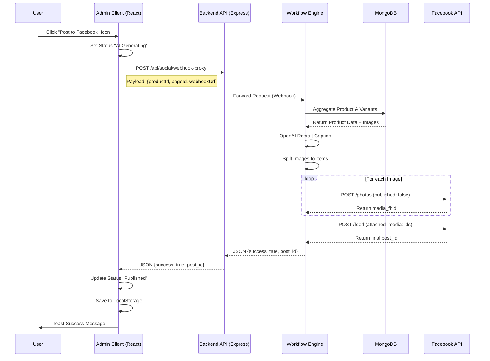

# Phân Tích Chi Tiết Tính Năng: [Đăng Sản Phẩm lên Facebook]

### 1. Công nghệ và Thư viện sử dụng
*Phân tích các file import để liệt kê các công nghệ chính tham gia vào tính năng này.*
* **Frontend:**
    * **React:** Framework UI chính.
    * **Axios (axiosInstance):** `admin/src/services/axiosConfig.ts` - Dùng để gọi API.
    * **Zustand/Context:** Không dùng Store global cho tính năng này, sử dụng `useState` và `localStorage`.
    * **Sonner (toast):** Hiển thị thông báo thành công/thất bại.
* **Backend:**
    * **Node.js / Express:** Server framework.
    * **node-fetch:** Dùng để forward request từ Server sang n8n webhook.
* **Database:**
    * **MongoDB (Mongoose):** Lưu trữ sản phẩm (`Product`) và biến thể (`Variant`).
* **Automation:**
    * **n8n (Self-hosted):** Workflow tự động hóa (AI generation, Image processing, Posting).
* **External Services:**
    * **OpenAI API:** Tạo caption.
    * **Facebook Graph API:** Upload ảnh và đăng bài (`/photos`, `/feed`).

### 2. Cấu hình và Biến môi trường
*Liệt kê tất cả các cấu hình cần thiết để tính năng này hoạt động.*
* **Server Environment (`.env`):**
    * Không có biến môi trường đặc thù cho tính năng này ở backend vì URL webhook được gửi từ Client.
* **Client Local Storage:**
    * `social_settings`: Lưu cấu hình người dùng nhập vào (Webhook URL, Page ID).
    * `social_posted_products`: Lưu lịch sử và trạng thái các bài đã đăng.
* **n8n Credentials:**
    * **Facebook OAuth2 / App Token:** Để quyền `pages_manage_posts`, `pages_show_list`.
    * **OpenAI API Key:** Để chạy node AI generation.

### 3. Kiến trúc Tổng quan
* **Tóm tắt:** Tính năng cho phép người quản trị chọn một sản phẩm từ dashboard, tự động tạo nội dung bằng AI và đăng bài viết (kèm nhiều ảnh) lên Facebook Fanpage thông qua quy trình tự động hóa n8n.
* **Sơ đồ luồng dữ liệu:**



### 4. Triển khai Frontend (Client-Side)
* **Cấu trúc Component:**
    * **File chính:** `admin/src/pages/content/SocialPostsPage.tsx` - Layout chính.
    * **Component danh sách:** `admin/src/features/social-posts/components/SocialPostList.tsx` - Hiển thị bảng sản phẩm và nút Post.
    * **Component lưới:** `admin/src/features/social-posts/components/SocialPostGrid.tsx` - Hiển thị lưới sản phẩm và nút Post.
* **Quản lý State:**
    * **Local State (`useSocialPosts.ts`):** 
        * `postedProducts`: Mảng lưu trạng thái bài đăng (đọc/ghi từ `localStorage`).
        * `postingProductId`: ID đang xử lý (loading spinner).
* **Dữ liệu đầu vào & Validate:**
    * **Validation:** Kiểm tra `isConfigured` trong hook `useSocialPosts.ts` (dòng 50-53) trước khi gọi API. 
    * **Quy tắc:** Phải nhập Webhook URL và Page ID trong mục Settings trước.
* **Tầng Network:**
    * **Hàm Trigger:** `handlePost(productId)` trong `admin/src/features/social-posts/hooks/useSocialPosts.ts`.
    * **API Client:** `socialApi.postToFacebook` trong `admin/src/features/social-posts/api/socialApi.ts`.
    * **Payload:**
      ```json
      {
        "webhookUrl": "https://n8n.devenir.shop/webhook/...",
        "productId": "65cb...",
        "pageId": "1002...",
        "postType": "multi_image"
      }
      ```

### 5. Giao diện API (Contract)
* **Endpoint:** `POST /api/social/webhook-proxy`
* **Bảo mật:**
    * **Auth:** Yêu cầu Admin Token (được xử lý bởi `axiosInstance` tự động đính kèm `Authorization` header).
* **Request Body:**
    ```typescript
    interface FacebookPostRequest {
        webhookUrl: string; // URL của n8n webhook
        productId: string;  // ID sản phẩm cần đăng
        pageId: string;     // ID của Facebook Page
        postType?: string;  // Mặc định: "multi_image"
    }
    ```
* **Response:**
    * **Thành công (200):**
      ```json
      {
        "success": true, 
        "message": "Posted successfully!", 
        "post_id": "123456_789012"
      }
      ```
    * **Lỗi (400/500):** `{ "success": false, "error": "Error message" }`

### 6. Triển khai Backend (Server-Side)
* **Định tuyến (Routing):**
    * **File:** `server/routes/socialRoutes.js`
    * **Middleware:** Check Auth (nếu có áp dụng global).
* **Controller / Handler:**
    * **File:** `server/routes/socialRoutes.js` (Handler được viết trực tiếp trong route).
    * **Xử lý:**
        1.  **Validate:** Kiểm tra `webhookUrl`, `productId`, `pageId` có tồn tại không (dòng 15-27).
        2.  **Smart Routing:** Nếu `webhookUrl` chứa domain nội bộ (ví dụ `n8n.devenir.shop`), server tự động thay thế bằng IP nội bộ Docker (`http://n8n:5678`) để tránh lỗi network loopback (dòng 38-45).
        3.  **Forwarding:** Dùng `node-fetch` gửi method `POST` tới n8n (dòng 40-48).
        4.  **Response Handling:** Đọc response từ n8n và trả về client, giữ nguyên status code nếu n8n báo lỗi (dòng 61-74).

### 7. Tác động Cơ sở dữ liệu
* **Bảng/Collection:** 
    * **MongoDB:** Hiện tại **KHÔNG** ghi trực tiếp trạng thái post vào database (chỉ đọc).
* **Thao tác:**
    * **Read-Olny:** n8n đọc `products` và `productvariants` để lấy dữ liệu content.
    * **Client Storage:** Trạng thái `published` được lưu ở Client `localStorage` (key: `social_posted_products`).
    * **Đề xuất cải tiến:** Nên thêm trường `social_posts: [{ platform: 'facebook', id: '...', status: 'published' }]` vào schema `Product` để đồng bộ giữa các admin.

### 8. Kiểm thử và Xác minh
* **Happy Path (Luồng chuẩn):**
    1.  Vào Admin -> Social Posts.
    2.  Click icon "Settings", nhập Webhook URL (Production) và Page ID.
    3.  Click icon máy bay (Post) ở một sản phẩm.
    4.  Trạng thái chuyển sang màu vàng (AI Generating).
    5.  Chờ 5-10s -> Trạng thái chuyển xanh (Published) + Toast Success.
    6.  Kiểm tra trên Facebook Page thấy bài viết mới.
* **Các lỗi thường gặp:**
    * *Lỗi:* "Webhook URL is required" -> *Nguyên nhân:* Chưa lưu Settings hoặc sai key localStorage.
    * *Lỗi:* "500 Internal Server Error" -> *Nguyên nhân:* n8n workflow bị lỗi (ví dụ: OpenAI hết quota, Token Facebook hết hạn) hoặc Server không connect được n8n.
    * *Lỗi:* "CORS Error" -> *Nguyên nhân:* Client gọi trực tiếp n8n thay vì qua Proxy (đã fix bằng Proxy).