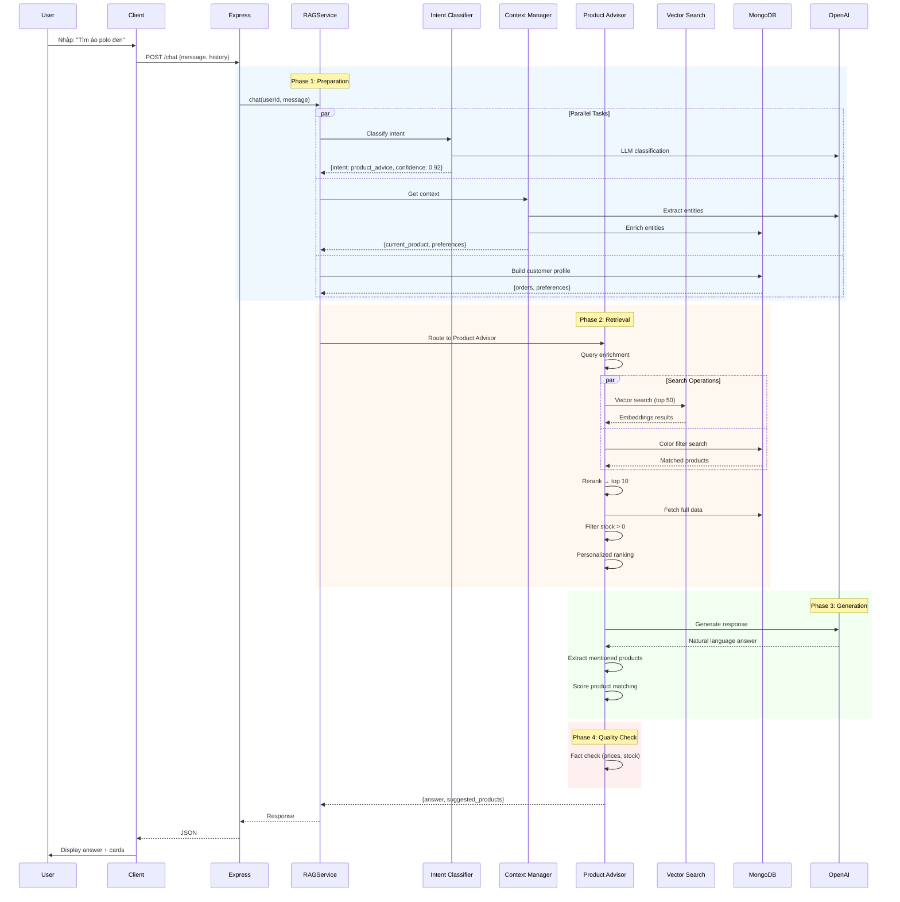

# Workflow: Hệ Thống RAG Chat AI

> **Mô tả:** Luồng xử lý hoàn chỉnh từ User Input → AI Response  
> **Version:** 2.0.0  
> **Updated:** 13/02/2026  

---

## 1. Tổng Quan Hệ Thống

### Mục đích
AI Chat Assistant tích hợp RAG (Retrieval-Augmented Generation) cho:
- **Customer:** Tư vấn sản phẩm, size, phong cách, tra cứu đơn hàng
- **Admin:** Analytics (doanh thu, tồn kho, insights)

### Kiến trúc Tổng Quát
```
User → React Client → Express API → RAG Service → OpenAI + Pinecone + MongoDB
```

### Công nghệ Stack
- **LLM:** OpenAI GPT-4.1-mini
- **Vector DB:** Pinecone (product embeddings)
- **Database:** MongoDB (products, orders, users)
- **Cache:** Redis + In-Memory
- **Reranking:** Cohere Rerank API

---

## 2. Cấu Trúc Thư Mục Server (`server/services/rag/`)

```
rag/
├── core/                          # Core Infrastructure
│   ├── RAGService.js             # ⭐ Main orchestrator
│   ├── LLMProvider.js            # OpenAI wrapper
│   └── VectorStore.js            # Pinecone client
│
├── orchestrators/                 # Workflow Controllers
│   ├── intent-classifier.js      # Phân loại ý định (7 intents)
│   ├── enhanced-context-manager.js  # Context + Entity extraction
│   └── conversation-manager.js   # Base conversation history
│
├── specialized/                   # Intent Handlers
│   ├── product-advisor.service.js    # Tư vấn sản phẩm (RAG chính)
│   ├── size-advisor.service.js       # Tư vấn size
│   ├── style-matcher.service.js      # Phối đồ
│   ├── order-lookup.service.js       # Tra cứu đơn
│   ├── policy-faq.service.js         # FAQ
│   ├── add-to-cart.service.js        # Add to cart handler
│   └── admin-analytics.service.js    # Admin analytics
│
├── retrieval/                     # Search Layer
│   ├── adaptive-hybrid-search.service.js  # Dynamic vector+text mix
│   ├── vector-search.service.js     # Pinecone search
│   ├── keyword-search.service.js    # MongoDB text search
│   ├── hybrid-search.service.js     # Combine results
│   └── reranking.service.js         # Cohere rerank
│
├── generation/                    # Response Generation
│   ├── response-generator.js     # LLM response builder
│   ├── prompt-builder.js         # Dynamic prompt construction
│   └── prompts/                  # Prompt templates
│
├── query-transformation/          # Query Enhancement
│   ├── query-expander.service.js    # Synonyms, related terms
│   ├── query-rewriter.service.js    # Rephrase for better search
│   └── query-decomposer.service.js  # Break complex queries
│
├── personalization/               # User Preference
│   ├── user-profiler.service.js     # Build user profile
│   └── personalized-ranking.service.js  # Rank by preference
│
├── quality/                       # Quality Assurance
│   ├── fact-checker.service.js      # Verify prices, stock, names
│   ├── quality-metrics.service.js   # Track quality scores
│   └── citation-manager.service.js  # Source citations
│
├── cache/                         # Caching Layer
│   ├── rag-cache.service.js         # Redis + In-Memory
│   └── semantic-cache.service.js    # Similar query cache
│
├── knowledge/                     # Domain Knowledge
│   └── product-knowledge.service.js # Product insights
│
├── embeddings/                    # Vector Generation
│   ├── embedding.service.js         # Generate embeddings
│   └── proposition.service.js       # Text chunking
│
├── utils/                         # Utilities
│   ├── logger.js                    # Structured logging
│   ├── errors.js                    # Custom error classes
│   ├── colorUtils.js                # VI ↔ EN color mapping
│   └── dateUtils.js                 # Date parsing
│
├── monitoring/                    # Observability
│   └── metrics.js                   # Prometheus metrics
│
├── constants.js                   # Config constants
└── index.js                       # Public API exports
```

---

## 3. Luồng Xử Lý Chính (Main Workflow)

### 3.1. Sequence Diagram



---

## 4. Flow Chi Tiết Từng Phase

### Phase 1: Request Preparation

#### 1.1. Intent Classification
**Mục đích:** Xác định user muốn gì

**7 Intents:**
- `product_advice` - Tìm/tư vấn sản phẩm
- `size_recommendation` - Tư vấn size
- `style_matching` - Phối đồ
- `order_lookup` - Tra đơn hàng
- `policy_faq` - Chính sách, FAQ
- `add_to_cart` - Thêm giỏ hàng
- `admin_analytics` - Admin queries

**Workflow:**
1. **Quick Filter:** Check keywords trước (fast path)
   - Có "size", "cỡ" → `size_recommendation`
   - Có "đơn hàng", "order" → `order_lookup`
2. **LLM Classification:** Nếu không match → gọi OpenAI
3. **Output:** `{intent, confidence, extracted_info}`

---

#### 1.2. Context Management
**Mục đích:** Hiểu ngữ cảnh cuộc trò chuyện

**Workflow:**
1. **Topic Change Detection:**
   - User chuyển chủ đề ("Thôi, tìm quần") → reset context
   - Dùng LLM so sánh message hiện tại vs lịch sử

2. **Entity Extraction:** Gọi LLM extract:
   - `current_product`: Sản phẩm đang bàn
   - `user_measurements`: Chiều cao, cân nặng
   - `preferences`: Màu, size, style
   - `conversation_topic`: Chủ đề hiện tại

3. **Entity Enrichment:**
   - Tìm product ID từ tên trong MongoDB
   - Validate measurements
   - Normalize colors (VI → EN)

4. **Output:** Enhanced context với entities đầy đủ

---

#### 1.3. Customer Profiling
**Mục đích:** Cá nhân hóa recommendations

**Workflow:**
1. Query 50 orders gần nhất
2. Analyze patterns:
   - Size thường mua
   - Màu yêu thích
   - Categories ưa thích
   - Budget range
   - Order frequency
3. Calculate:
   - `spendingPower`: low/medium/high/premium
   - `customerType`: new/returning/vip
   - `styleProfile`: minimalist/casual/formal

---

### Phase 2: Retrieval & Ranking

#### 2.1. Query Transformation
**Mục đích:** Tối ưu query cho search

**Steps:**
1. **Query Enrichment:**
   - Message ngắn ("Cái này?") → thêm context từ tin nhắn trước
   - Thêm product names từ bot response trước

2. **Query Expansion:**
   - "quà tặng" → "quà tặng gift present birthday"
   - "áo thun" → "áo thun t-shirt tee polo"

3. **Color Detection:**
   - Extract màu từ query
   - Map VI → EN: "đen" → "black"

---

#### 2.2. Hybrid Search
**Mục đích:** Tìm products relevant nhất

**3 Search Methods Combined:**

1. **Vector Search (Pinecone):**
   - Embed query → vector
   - Similarity search → top 50
   - Tốt cho semantic matching

2. **Keyword Search (MongoDB):**
   - Text search với indexes
   - Exact name matching
   - Tốt cho specific products

3. **Color-Specific Filter:**
   - Nếu có màu trong query → filter variants
   - MongoDB: `{color: /black/i, quantity: {$gt: 0}}`

**Adaptive Weighting:**
- Query cụ thể ("Áo Polo Classic") → vector 30%, keyword 70%
- Query semantic ("áo mặc đi làm") → vector 80%, keyword 20%

---

#### 2.3. Reranking
**Mục đích:** Nén 50 results → 10 best

**Workflow:**
1. Send query + 50 docs → Cohere Rerank API
2. Cohere scores mỗi doc (relevance_score)
3. Return top 10 reranked

**Benefits:**
- Precision cao hơn vector search alone
- Remove noise

---

#### 2.4. Stock Filtering ⚠️ **CRITICAL**
**Mục đích:** Chỉ gợi ý sản phẩm còn hàng

**Workflow:**
1. Fetch full product data từ MongoDB
2. Fetch ALL variants (single optimized query)
3. Filter: `variants.some(v => v.quantity > 0)`
4. **Early return nếu 0 products có stock** → "Rất tiếc hết hàng"

**Why critical?**
- Tránh recommend sản phẩm hết hàng
- UX tốt hơn

---

#### 2.5. Personalized Ranking
**Mục đích:** Sắp xếp theo sở thích user

**Boosting Logic:**
- Size match: +15%
- Color match: +10%
- Category preference: +12%
- Price in budget: +8%

**Formula:**
```
personalizedScore = baseScore × (1 + boosts)
```

**Example:**
- Product A: baseScore=0.89, có size match → 0.89 × 1.15 = 1.02
- Product B: baseScore=0.92, không match → 0.92 × 1.0 = 0.92
- Result: A ranks higher

---

### Phase 3: Response Generation

#### 3.1. Context Building
**Mục đích:** Chuẩn bị context cho LLM

**Structure:**
```
## Sản phẩm liên quan:

### 1. [Product Name]
- Danh mục: [Category]
- Màu sắc: [Colors]
- Giá: $[min] - $[max]
- Sizes: [Available sizes]
- Còn hàng: [Stock count]

[Repeat for all products]

## Thông tin bổ sung:
[Knowledge base snippets]
```

**Priority Order:**
1. Color-matched products first
2. Vector search results
3. Knowledge base info

---

#### 3.2. LLM Generation
**Mục đích:** Sinh câu trả lời natural

**Prompt Structure:**
```
System: [Role + Instructions + Customer profile]
History: [Recent conversation]
User: Context: [Built context] + Query: [User question]
```

**Parameters:**
- Model: gpt-4o-mini
- Temperature: 0.3 (deterministic)
- Max tokens: 800
- Timeout: 30s

---

#### 3.3. Product Matching & Scoring
**Mục đích:** Chọn 3 products show trong cards

**Workflow:**
1. **Extract mentions:** Parse LLM answer, tìm product names trong `**bold**`
2. **Score matching:**
   - Exact name match: 200 points
   - Substring match: 150 points
   - Product type match: 60 points
   - Color match bonus: +20
   - Personalization bonus: +0-50
3. **Sort by score → top 3**

**Fallback:** Nếu không extract được → dùng top 3 từ reranked list

---

### Phase 4: Quality Assurance

#### 4.1. Fact Checking
**Mục đích:** Verify thông tin trong answer

**4 Checks:**

1. **Price Verification:**
   - Extract prices từ answer
   - So với prices trong sources
   - Allow ±5% tolerance

2. **Stock Verification:**
   - Nếu answer nói "còn hàng" → check DB thực tế
   - Block response nếu claim sai

3. **Product Name Accuracy:**
   - Check tên sản phẩm có match sources không
   - Threshold: 80% accuracy

4. **Attribute Verification:**
   - Colors mentioned phải tồn tại trong variants
   - Sizes mentioned phải available

**Final Status:**
- `verified`: All checks passed
- `partial`: Some checks failed (warnings)
- `failed`: Critical check failed → reject response

---

## 5. Cấu Trúc Frontend (`client/src/features/chat/`)

### 5.1. Component Tree
```
<ChatIcon>                      Floating button
  └─ onClick → open ChatWindow

<ChatWindow>                    Main container
  ├── <ChatHeader>             Model name + controls
  ├── Initial View
  │   ├── <DeviIcon>           Animated AI avatar
  │   ├── Welcome text         GSAP animation
  │   └── <ChatPrompts>        Quick actions (6 buttons)
  └── Messages View
      ├── <ChatMessage>[]      Message bubbles
      │   ├── <StreamingText>  Typewriter effect
      │   ├── <ChatProductCard>[]  Product carousel
      │   ├── <iframe>         Google Maps (if location)
      │   └── <ChatActionButtons>  Yes/No (add cart)
      ├── Typing indicator     3 animated dots
      └── <ChatInput>          Input + Send button
```

### 5.2. Hook Architecture
```
useChat (Main Composition)
  ├── useAuthStore         Zustand (user, token)
  ├── useChatMessages      Message state + API calls
  ├── useChatActions       Handle Yes/No actions
  └── State merging        Combine all states
```

### 5.3. State Management Strategy
- **Global (Zustand):** Auth only
- **Local (useState):** Messages, actions, input
- **Server (React Query):** Not used for chat (future optimization)

### 5.4. Key UX Features
1. **Streaming Animation:** Typewriter effect với RAF (60fps)
2. **Auto Scroll:** Scroll to latest message
3. **Optimistic UI:** Show user message immediately
4. **GSAP Animations:** Welcome text slide-up effect
5. **Lazy Loading:** Product images
6. **Responsive:** Hidden on mobile

---

## 6. Error Handling & Edge Cases

### 6.1. Common Scenarios

**Scenario 1: API Timeout**
- LLM request > 30s → TimeoutError
- Retry 3 times với exponential backoff
- Final failure → User-friendly message

**Scenario 2: Rate Limit**
- OpenAI rate limit → LLMRateLimitError
- Wait for retry-after header
- Show "Đang xử lý, vui lòng đợi"

**Scenario 3: No Products Found**
- Vector search returns 0 → Fallback to MongoDB text search
- Still 0 → "Không tìm thấy sản phẩm phù hợp"

**Scenario 4: All Products Out of Stock**
- After filtering → 0 products
- Return early: "Rất tiếc sản phẩm đang hết hàng"

**Scenario 5: Fact Check Failed**
- Price hallucination detected
- **Block response**, regenerate with strict prompt
- Log warning for monitoring

---

## 7. Performance Optimization

### 7.1. Caching Strategy

**Multi-Layer Cache:**
1. **Redis (Distributed):**
   - Intent: 5 min TTL
   - Vector search: 1 hour TTL
   - Knowledge: 30 min TTL

2. **In-Memory (Process-local):**
   - Color mappings: Permanent
   - Synonyms: Permanent
   - Fallback when Redis down

**Cache Keys:**
```
rag:intent:{userId}:{hash(message)}
rag:vector:{hash(query)}:{hash(options)}
rag:knowledge:{productId}
```

### 7.2. Database Optimization
- **Indexes:** sku, slug, status, category
- **Lean queries:** `.lean()` cho read-only
- **Aggregation:** Dùng pipeline cho analytics
- **Single query:** Fetch all variants once (không loop)

### 7.3. LLM Optimization
- **Model:** gpt-4o-mini (faster, cheaper)
- **Parallel calls:** Intent + Context + Profile đồng thời
- **Short prompts:** Minimize tokens
- **Timeout:** 30s hard limit

---

## 8. Monitoring & Observability

### 8.1. Logging
**Structured logs (Winston):**
- Request start/complete
- Intent classification
- Vector search results
- LLM requests (tokens used)
- Fact check warnings
- Cache hit/miss rates

**Log Levels:**
- `info`: Normal operations
- `warn`: Fact check failed, retries
- `error`: Failures, exceptions

### 8.2. Metrics (Prometheus)
```
rag_request_duration_seconds      Histogram (P50, P95, P99)
rag_cache_hit_total               Counter by cache type
rag_fact_check_failures_total     Counter
rag_intent_confidence             Histogram
rag_products_suggested            Histogram
```

### 8.3. Health Check
**Endpoint:** `GET /api/rag/health`

**Response:**
```json
{
  "status": "healthy",
  "version": "2.0.0",
  "metrics": {
    "totalRequests": 1523,
    "successRate": "98.36%",
    "avgResponseTimeMs": 1842
  }
}
```

---

## 9. Configuration

### 9.1. Environment Variables
```bash
# LLM
OPENAI_API_KEY=sk-...
DEFAULT_LLM_MODEL=gpt-4o-mini

# Vector DB
PINECONE_API_KEY=...
PINECONE_INDEX=devenir-products

# Reranking
COHERE_API_KEY=...

# Feature Flags
ENABLE_FACT_CHECKING=true
ENABLE_PERSONALIZATION=true
ENABLE_SEMANTIC_CACHE=true

# Performance
HYBRID_SEARCH_TOP_K=50
RERANK_TOP_N=10
```

### 9.2. Constants
- Intent confidence threshold: 0.7
- Vector search min score: 0.7
- Max conversation history: 10 messages
- LLM timeout: 30s
- Cache TTLs: 5min (intent), 1h (vector), 30min (context)

---

## 10. Testing Strategy

### 10.1. Unit Tests
**Coverage targets:**
- Intent classification: 90%
- Query transformation: 85%
- Fact checker: 95%
- Color utils: 100%

### 10.2. Integration Tests
**Key flows:**
1. Product search happy path
2. Context continuity
3. Topic change detection
4. Stock validation
5. Fact check blocking

### 10.3. Load Testing
**Targets:**
- 100 concurrent users
- P95 latency < 2s
- 0 errors under normal load
- Graceful degradation at 2x load

---

## 11. Deployment Workflow

### 11.1. Pre-deployment Checklist
- [ ] All tests passing
- [ ] Fact checking enabled
- [ ] Redis connected
- [ ] Pinecone index ready
- [ ] Environment variables set
- [ ] Monitoring dashboard configured

### 11.2. Rollout
1. Deploy to staging
2. Run smoke tests
3. Gradual rollout: 10% → 50% → 100%
4. Monitor error rates
5. Rollback if error rate > 1%

---

## 12. Troubleshooting Guide

### Issue 1: Slow Response (>3s)
**Diagnose:**
- Check Redis connection: `redis-cli ping`
- Check Pinecone latency in logs
- Check LLM token usage

**Fix:**
- Reduce `HYBRID_SEARCH_TOP_K` to 30
- Reduce `RERANK_TOP_N` to 5
- Increase LLM timeout warning threshold

---

### Issue 2: Recommending Out-of-Stock Products
**Diagnose:**
- Check fact checking logs
- Check product filter logs

**Fix:**
- Ensure `ENABLE_FACT_CHECKING=true`
- Verify stock filter in `product-advisor.service.js`

---

### Issue 3: Wrong Intent Classification
**Diagnose:**
- Check intent confidence in logs
- Test with isolated intent classifier

**Fix:**
- Add keywords to quick filter
- Improve LLM classification prompt
- Increase confidence threshold

---

## 13. Future Improvements

### 13.1. Short-term (1-3 months)
- [ ] React Query cho chat history caching
- [ ] Streaming responses (chunk by chunk)
- [ ] Voice input support
- [ ] Image-based search

### 13.2. Long-term (6-12 months)
- [ ] Multi-language support (EN, VI)
- [ ] Advanced analytics (user journey tracking)
- [ ] A/B testing framework
- [ ] Custom LLM fine-tuning

---

**End of Workflow Documentation**
