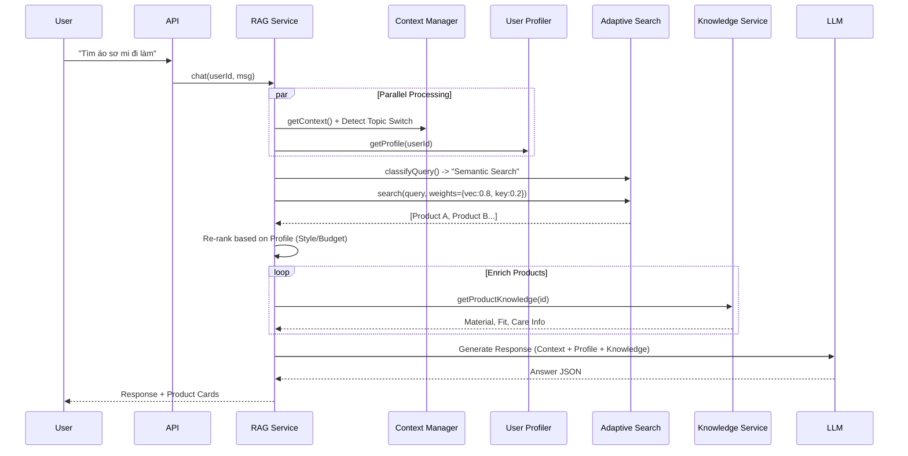

# 🧠 Devenir RAG System Documentation (v3.5)

> **Tài liệu Kỹ thuật Tổng hợp**  
> *Phiên bản: 3.5 (Enterprise) - Cập nhật: 11/02/2026*

Chào mừng bạn đến với tài liệu kỹ thuật của hệ thống **Devenir AI Engine**. Tài liệu này mô tả chi tiết kiến trúc của hệ thống RAG (Retrieval-Augmented Generation) thế hệ mới, tích hợp Deep Personalization, Adaptive Search và Domain Knowledge Intelligence.

---

## 1. Tổng Quan Hệ Thống

Hệ thống RAG của Devenir là một **AI-Powered Commerce Engine** phục vụ 2 đối tượng chính:

1.  **Client RAG (Fashion Advisor)**: Trợ lý ảo cá nhân hóa cao cấp.
    *   Tư vấn phối đồ (Style Advisory) dựa trên lịch sử mua sắm.
    *   Tìm kiếm thích ứng (Adaptive Search) theo ngữ cảnh.
    *   Phân tích Deep Knowledge về chất liệu, form dáng.
2.  **Admin RAG (Business Analyst)**: Trợ lý vận hành thông minh.
    *   Phân tích xu hướng (Trend Analysis).
    *   Dự báo nhu cầu và hiệu suất sản phẩm.

---

## 2. Kiến Trúc & Tech Stack

### 🛠 Tech Stack
*   **Core**: Node.js, Express.js (Service Layer Pattern).
*   **AI Models**: GPT-4.1-mini (Orchestration), GPT-4.1 (Deep Reasoning), text-embedding-3-small.
*   **Data Layer**:
    *   **MongoDB**: Metadata, Text Search, Logs, User Profiles.
    *   **Pinecone**: Vector Database (Semantic Search).
    *   **Redis** (Planned): Semantic Caching.
*   **Tools**: LangChain, Vitest (Testing), Winston (Logging).

### 🏗 Cấu trúc Thư mục (`server/services/rag/`)

Cấu trúc module hóa cao theo chức năng (Functional Modularity):

```
rag/
├── core/                  # Service Core (RAGService, VectorStore, LLMProvider)
├── orchestrators/         # Quản lý luồng (Context, Intent, Topic Detection)
├── retrieval/             # Search Engine (Adaptive Hybrid, Vector, Rerank)
├── query-transformation/  # Tối ưu hóa câu hỏi (Expansion, Decomposition)
├── personalization/       # [NEW] User Profiling & Behavioral Analysis
├── knowledge/             # [NEW] Product Domain Intelligence (Material, Fit)
├── specialized/           # Handlers nghiệp vụ (Product, Size, Style, Admin)
├── generation/            # Prompt Engineering & Streaming Response
├── monitoring/            # [NEW] Metrics & Analytics
└── utils/                 # Helpers (Logger, Dates, Colors)
```

---

## 3. Luồng Hoạt Động (The Pipeline v3.5)

Hệ thống xử lý query qua 6 bước chuyên sâu:

### Bước 1: Query Transformation & Intent Analysis
*   **Intent**: Sử dụng Hybrid Classification (Keyword + LLM) để phân loại chính xác (`product_advice`, `size_recommendation`, `style_matching`, `gift_recommendation`).
*   **Expansion**: Mở rộng từ khóa (ví dụ: "áo ấm" -> "áo khoác", "len", "dạ").

### Bước 2: Smart Context Management (`EnhancedContextManager`)
*   **Topic Change Detection**: Tự động phát hiện khi user đổi chủ đề (VD: đang hỏi Size -> chuyển sang Ship hàng) để reset context, tránh "ảo giác".
*   **Entity Extraction**: Trích xuất entity (Product, Color, Measurement) và lưu vào bộ nhớ đệm thông minh.

### Bước 3: Adaptive Hybrid Retrieval
Không chỉ tìm kiếm Vector, hệ thống tự động điều chỉnh trọng số (Weights) dựa trên loại câu hỏi (`AdaptiveHybridSearch`):
*   **Brand Search**: 70% Keyword / 30% Vector.
*   **Semantic Search**: 20% Keyword / 80% Vector (VD: "đồ đi tiệc tối").
*   **Attribute Search**: 65% Keyword / 35% Vector (VD: "áo đen size M").
*   **Boosters**:
    *   **Seasonality**: Ưu tiên đồ Thu/Đông nếu đang là tháng 11.
    *   **Popularity**: Ưu tiên sản phẩm bán chạy/nhiều view.

### Bước 4: Deep Personalization (`UserProfiler`)
Cá nhân hóa kết quả tìm kiếm dựa trên Profile người dùng (được xây dựng từ Orders & Chat Logs):
*   **Style Profile**: User thích Minimalism hay Luxury?
*   **Budget Range**: Mức chi tiêu trung bình.
*   **Fit History**: Lịch sử size (VD: thường mặc size L cho áo thun).
*   *Kết quả:* Re-rank lại danh sách sản phẩm để đưa món phù hợp nhất lên đầu.

### Bước 5: Domain Knowledge Enrichment (`ProductKnowledgeService`)
Làm giàu thông tin sản phẩm bằng dữ liệu chuyên sâu (không có trong DB thường):
*   **Material Analysis**: Phân tích chất vải (Natural vs Synthetic), độ co giãn, độ thoáng khí.
*   **Fit Intelligence**: Form dáng (Slim/Regular), độ khó sửa chữa (alteration).
*   **Designer Intent**: Ý đồ thiết kế (Layering, Statement piece).

### Bước 6: Generation & Response
*   **CoVe (Chain of Verification)**: Kiểm tra lại thông tin trước khi trả lời.
*   **Tone Matching**: Điều chỉnh giọng văn phù hợp với khách hàng.

---

## 4. Các Tính Năng Đột Phá (Capabilities)

### 🧠 1. Deep Product Knowledge
Hệ thống "hiểu" sản phẩm như một chuyên gia thời trang.
*   *Ví dụ:* Với áo len "Merino Wool", hệ thống biết: "Giữ nhiệt tốt (High Warmth), thoáng khí (High Breathability), cần giặt tay (Care Complexity: Medium)".

### 🎯 2. Adaptive Search Strategy
Thay vì fix cứng thuật toán, hệ thống "biến hình" theo câu hỏi.
*   Tìm "Gucci": Chuyển sang chế độ tìm chính xác tên.
*   Tìm "đồ đi date": Chuyển sang chế độ tìm vector ngữ nghĩa.

### 👤 3. Hyper-Personalization
Bot nhớ bạn hơn cả người yêu cũ.
*   Biết bạn thích màu đen, hay mặc size M, và sẵn sàng chi >2 triệu cho áo khoác.
*   Tự động lọc bỏ các gợi ý không phù hợp với Style Profile của bạn.

---

## 5. Hướng Dẫn Debug & Monitor

*   **Logs**: `logs/rag-service.log` (Winston JSON format).
*   **Metrics**: Theo dõi `avgResponseTime`, `personalizationRate`, `cacheHitRate`.
*   **Testing**:
    *   Unit Test: `npm run test:unit`
    *   RAG Evaluation: Kiểm tra độ chính xác của Retrieval và Generation.

---

## 6. Deep Dive: Luồng Xử Lý Chi Tiết

### 6.1 Sequence Diagram



### 6.2 Cấu trúc Dữ Liệu Phản Hồi (Response)

```json
{
  "intent": "product_advice",
  "answer": "Dựa trên gu ăn mặc Minimalism của anh, em gợi ý mẫu sơ mi Oxford này...",
  "suggested_products": [
    {
      "name": "Oxford Shirt Classic",
      "price": 850000,
      "_personalizedScore": 1.5,
      "_knowledge": {
        "material": "100% Cotton",
        "breathability": "High",
        "fitAdvice": "True to size",
        "seasonality": "All-season"
      }
    }
  ]
}
```

---
*Tài liệu nội bộ team Engineering - Vui lòng không share ra ngoài.*
