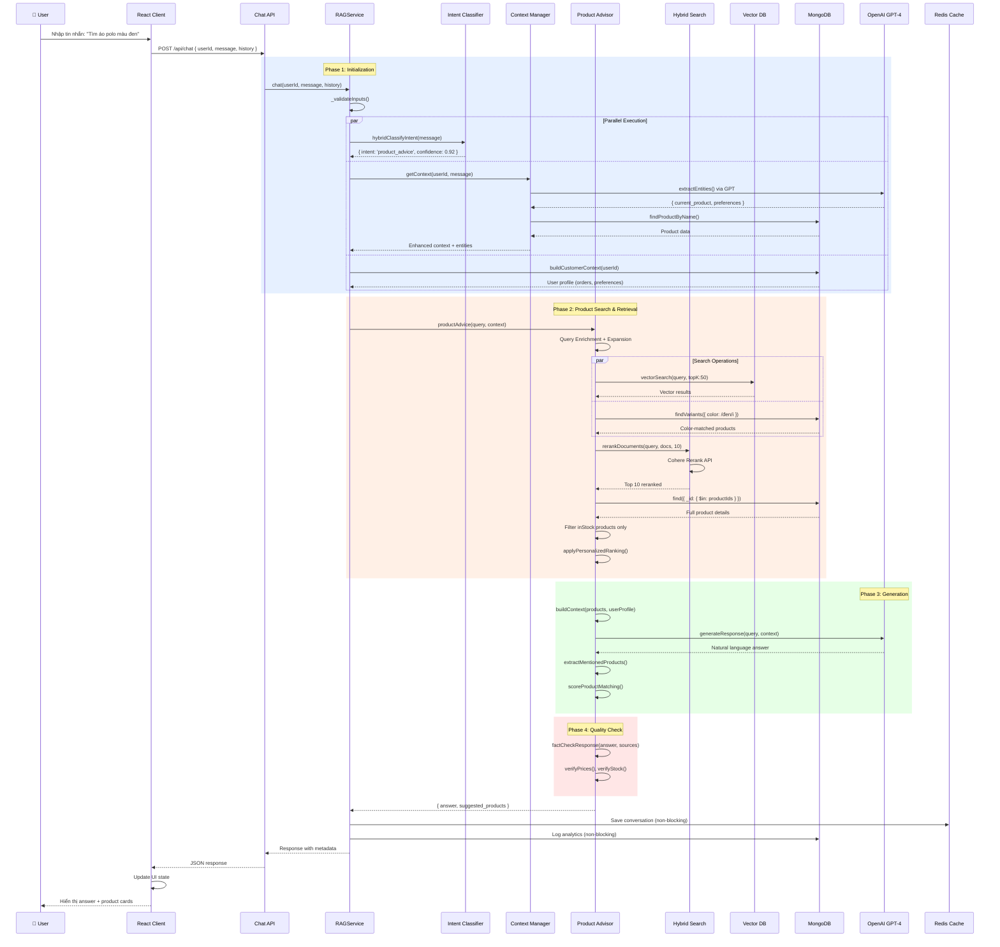

# Phân Tích Chi Tiết: Hệ Thống RAG (Retrieval-Augmented Generation)

> **Version:** 2.0.0 Enterprise  
> **Last Updated:** 12/02/2026  
> **Status:** Production Ready

## 1. Tổng Quan & Files Liên Quan

### Mục Đích
Hệ thống RAG của Devenir cung cấp AI Chat Assistant thông minh cho khách hàng và admin, với khả năng:
- Tư vấn sản phẩm thời trang nam dựa trên ngữ cảnh (Context-Aware)
- Tư vấn size cá nhân hóa
- Gợi ý phối đồ theo phong cách
- Tra cứu đơn hàng & chính sách
- Phân tích dữ liệu cho Admin (doanh thu, tồn kho, khách hàng)

### Kiến Trúc Toàn Cục
```
Client (React)  →  Server API  →  RAG Service  →  LLM (OpenAI) + Vector DB (Pinecone) + MongoDB
```

### Danh Sách Files Chính

#### 📁 Core Infrastructure (`server/services/rag/core/`)
- **`RAGService.js`** (485 lines): Orchestrator chính - điều phối toàn bộ pipeline
- **`LLMProvider.js`** (14KB): Wrapper cho OpenAI API với retry logic
- **`VectorStore.js`** (2.7KB): Client kết nối Pinecone

#### 📁 Orchestrators (`server/services/rag/orchestrators/`)
- **`intent-classifier.js`** (9.5KB): Phân loại ý định người dùng (7 intents)
- **`enhanced-context-manager.js`** (18KB): Quản lý conversation context + entity extraction
- **`conversation-manager.js`** (5.5KB): Base class quản lý lịch sử chat

#### 📁 Specialized Services (`server/services/rag/specialized/`)
- **`product-advisor.service.js`** (33KB): Tư vấn sản phẩm (RAG chính)
- **`size-advisor.service.js`** (26KB): Tư vấn size chi tiết
- **`admin-analytics.service.js`** (30KB): Analytics cho Admin
- **`order-lookup.service.js`**: Tra cứu đơn hàng
- **`policy-faq.service.js`**: FAQ chính sách
- **`style-matcher.service.js`**: Gợi ý phối đồ
- **`add-to-cart.service.js`**: Thêm giỏ hàng

#### 📁 Retrieval (`server/services/rag/retrieval/`)
- **`adaptive-hybrid-search.service.js`** (10KB): Hybrid Search với dynamic weighting
- **`vector-search.service.js`**: Tìm kiếm Vector (Pinecone)
- **`reranking.service.js`**: Rerank kết quả (Cohere)

#### 📁 Generation (`server/services/rag/generation/`)
- **`response-generator.js`**: Sinh câu trả lời từ LLM
- **`prompt-builder.js`** (7.6KB): Xây dựng prompts động
- **`prompts/size-advisor.prompt.js`**: Template cho size advisor

#### 📁 Quality & Personalization
- **`quality/fact-checker.service.js`** (10KB): Kiểm tra giá, stock, tên sản phẩm
- **`personalization/user-profiler.service.js`** (12KB): Xây dựng user profile
- **`personalization/personalized-ranking.service.js`**: Sắp xếp kết quả theo sở thích

#### 📁 Cache & Monitoring
- **`cache/rag-cache.service.js`** (17KB): Redis + In-Memory cache
- **`monitoring/metrics.js`**: Prometheus metrics

#### 📁 Utilities
- **`utils/logger.js`**: Structured logging
- **`utils/errors.js`**: Custom error classes
- **`utils/colorUtils.js`**: Color matching (VI ↔ EN)
- **`utils/dateUtils.js`**: Date parsing

---

## 2. Kiến Trúc & Luồng Dữ Liệu (Data Flow)

### 2.1. Sơ Đồ Tuần Tự (Sequence Diagram)



### 2.2. Diễn Giải Chi Tiết Luồng Hoạt Động (Step-by-Step Narrative)

#### Bước 1: User Interaction (Trigger)

**Entry Point:** User nhập tin nhắn vào chat widget và nhấn Enter.

**File:** `client/src/features/chat/components/ChatWindow.tsx`

- Component `ChatWindow` capture event `onSubmit` từ input form
- Call hook `useChatActions()` → function `sendMessage(content)`
- Hook set state `isLoading: true` để hiển thị typing indicator
- Validate message không rỗng, max 5000 chars tại client-side

**Code Reference:**
```typescript
// client/src/features/chat/hooks/useChatActions.ts
const sendMessage = async (content: string) => {
  setIsLoading(true)
  try {
    await chatApi.sendMessage(userId, content, conversationHistory)
  } finally {
    setIsLoading(false)
  }
}
```

---

#### Bước 2: Client-Side Processing

**File:** `client/src/features/chat/api/chatApi.ts`

Function `sendMessage()` construct payload và gọi API:

```typescript
// Line 45-60
const sendMessage = (userId, message, history) => {
  return axios.post('/api/chat', {
    userId,              // ObjectId của user
    message,             // "Tìm áo polo màu đen"
    conversationHistory  // Array các tin nhắn trước
  }, {
    headers: { 
      'Authorization': `Bearer ${token}`,
      'Content-Type': 'application/json' 
    }
  })
}
```

**Network Request được gửi:**
- Method: `POST /api/chat`
- Headers: Authorization token (JWT) + Content-Type
- Body: `{ userId, message, conversationHistory }`

---

#### Bước 3: Server-Side Entry Point

**File:** `server/routes/chatRoutes.js`

Request đi qua các middleware:
1. **`authenticate`**: Verify JWT token → gắn `req.user`
2. **`rateLimiter`**: Check rate limit (60 req/min)

```javascript
// Line 12
router.post('/chat', authenticate, rateLimiter, ChatController.sendMessage)
```

**File:** `server/controllers/ChatController.js` (Line 28-50)

```javascript
async sendMessage(req, res) {
  const { message, conversationHistory } = req.body
  const userId = req.user._id
  
  // Validate
  if (!message || message.length > 5000) {
    return res.status(400).json({ error: 'Invalid message' })
  }
  
  // Gọi RAGService
  const result = await ragService.chat(userId, message, conversationHistory)
  
  res.json(result)
}
```

Controller **không chứa business logic**, chỉ validate và delegate sang `RAGService`.

---

#### Bước 4: RAG Service Orchestration

**File:** `server/services/rag/core/RAGService.js` (Line 96-190)

**Function:** `async chat(userId, message, conversationHistory)`

**Phase 4.1: Validation & Parallel Execution**

```javascript
// Line 106: Validate inputs
this._validateInputs(userId, message)

// Line 109-113: 3 tác vụ chạy song song
const [intentResult, context, customerContext] = await Promise.all([
  hybridClassifyIntent(message, conversationHistory),
  this.conversationManager.getContext(userId, message, conversationHistory),
  buildCustomerContext(userId)
])
```

**Chi tiết từng tác vụ:**

**A. Intent Classification** (`orchestrators/intent-classifier.js`)
- Function `hybridClassifyIntent()` (Line 230-280)
- **Step 1 - Quick Detection:** Check keywords trước (Line 236)
  ```javascript
  if (message.includes('size') || message.includes('cỡ')) {
    return { intent: 'size_recommendation', confidence: 0.9 }
  }
  ```
- **Step 2 - LLM Classification:** Nếu không match keyword, gọi OpenAI (Line 265)
  ```javascript
  const completion = await llmProvider.chat([
    { role: 'system', content: INTENT_CLASSIFICATION_PROMPT },
    { role: 'user', content: message }
  ])
  // Parse JSON: { intent, confidence, extracted_info }
  ```

**B. Context Management** (`orchestrators/enhanced-context-manager.js`)
- Function `getContext()` (Line 24-97)
- **Topic Change Detection** (Line 30-40):
  ```javascript
  const shouldResetContext = await this.detectTopicChange(
    currentMessage, baseContext.history, recentMessages
  )
  // Nếu user chuyển topic ("Thôi, tìm quần") → clear sticky context
  ```
- **Entity Extraction** (Line 256-341): Gọi LLM để extract
  ```javascript
  // Prompt LLM: "Extract current_product, preferences, measurements..."
  const result = await llmProvider.jsonCompletion([...])
  // Returns: { current_product: {name, id}, user_measurements: {...} }
  ```
- **Entity Enrichment** (Line 365-395): Tìm product ID trong MongoDB
  ```javascript
  const product = await Product.findOne({ 
    name: new RegExp(productName, 'i') 
  })
  entities.current_product.id = product._id
  ```

**C. Customer Context** (`utils/customerContext.js`)
- Function `buildCustomerContext(userId)` (Line 15-80)
- Query last 50 orders của user
- Analyze để build profile:
  ```javascript
  {
    preferredSize: 'L',              // Size hay mua nhất
    favoriteColors: ['black', 'navy'], // Màu hay mua
    spendingPower: 'high',            // Dựa vào avgOrderValue
    customerType: 'vip'               // ≥10 orders
  }
  ```

**Phase 4.2: Route to Specialized Service**

```javascript
// Line 135-143: RAGService.js
const result = await this._routeToService(
  intent, message, extracted_info, enrichedContext, customerContext, userId
)

// Switch case based on intent
switch (intent) {
  case 'product_advice':
    return await productAdvice(message, context)
  case 'size_recommendation':
    return await sizeRecommendation(message, extractedInfo, context)
  // ... 5 intents khác
}
```

---

#### Bước 5: Product Advisor Pipeline (Core Business Logic)

**File:** `server/services/rag/specialized/product-advisor.service.js`

**Function:** `async productAdvice(query, context)` (Line 116-741)

**Step 5.1: Query Enrichment** (Line 119-167)

```javascript
// Nếu query ngắn hoặc có từ tham chiếu ("này", "đó")
if (query.length < 100 || query.includes('này')) {
  // Extract product names từ tin nhắn bot trước
  const lastBotMsg = recentMessages.find(m => m.role === 'assistant')
  const productNames = lastBotMsg.match(/\*\*([^*]+)\*\*/g)
  
  // Enrich query
  enrichedQuery = `${query} ${productNames.join(' ')}`
  // "Cái này có màu gì?" → "Cái này có màu gì? Áo Polo Classic"
}

// Line 163: Expand synonyms
const expanded = expandQuery(enrichedQuery)
// "quà tặng" → "quà tặng gift present birthday"
```

**Step 5.2: Hybrid Search** (Line 170-235)

**Parallel search operations:**

```javascript
const [searchResults, kbResults] = await Promise.all([
  // A. Vector Search (Pinecone)
  searchProducts(enrichedQuery, { topK: 50 }),
  
  // B. Knowledge Base Search
  searchKnowledgeBase(enrichedQuery, { topK: 3 })
])

// C. Color-specific filtering (Line 176-190)
const requestedColor = await findColorInQuery(query) // "đen" → {vi:'đen', en:'black'}
if (requestedColor) {
  const colorVariants = await ProductVariant.find({
    color: new RegExp(requestedColor.en, 'i'),
    quantity: { $gt: 0 }
  })
  colorMatchedProductIds = colorVariants.map(v => v.product_id)
}
```

**Fallback strategy** (Line 192-228): Nếu vector search fail
```javascript
if (searchResults.length === 0) {
  const fallback = await searchByCategoryMongoDB(query)
  // Text search: Product.find({ $text: { $search: query } })
}
```

**Step 5.3: Reranking** (Line 237-239)

```javascript
// File: retrieval/reranking.service.js
const reranked = await rerankDocuments(enrichedQuery, documents, 10)

// Gọi Cohere Rerank API:
// POST https://api.cohere.ai/v1/rerank
// { query, documents, top_n: 10 }
// → Trả về 10 docs có relevance_score cao nhất
```

**Step 5.4: Fetch Full Product Data** (Line 264-290)

```javascript
// Get product IDs từ reranked results
const productIds = reranked.map(r => searchResults[r.index].metadata.product_id)

// Fetch từ MongoDB (with populate)
const products = await Product.find({ _id: { $in: productIds } })
  .populate('category')
  .lean()

// Fetch ALL variants (optimized: single query)
const allVariants = await ProductVariant.find({
  product_id: { $in: productIds },
  isActive: true,
  quantity: { $gt: 0 }  // Chỉ lấy có hàng
}).lean()

// Group variants by product
const variantsByProductId = allVariants.reduce((acc, variant) => {
  acc[variant.product_id] = acc[variant.product_id] || []
  acc[variant.product_id].push(variant)
  return acc
}, {})
```

**Step 5.5: Stock Filtering** (Line 293-323) ⚠️ **CRITICAL**

```javascript
const inStockProducts = productsWithVariants.filter(product => {
  const hasStock = product.variants.some(v => v.quantity > 0)
  
  if (!hasStock) {
    console.log(`⚠️ Filtered out (no stock): ${product.name}`)
  }
  
  return hasStock
})

// Early return nếu không có sản phẩm nào có hàng
if (inStockProducts.length === 0) {
  return {
    answer: "Rất tiếc, sản phẩm đang hết hàng...",
    suggested_products: []
  }
}
```

**Step 5.6: Personalized Ranking** (Line 326-352)

```javascript
if (process.env.ENABLE_PERSONALIZATION === 'true') {
  const userProfile = await userProfiler.getProfile(userId)
  
  // File: personalization/personalized-ranking.service.js
  const scored = applyPersonalizedRanking(inStockProducts, userProfile)
  
  // Boost score calculation:
  // baseScore × (1 + sizeBoost + colorBoost + categoryBoost + priceBoost)
  // - Size match: +15%
  // - Color match: +10%
  // - Category preference: +12%
  // - Price in budget: +8%
  
  personalizedProducts = scored.map(sp => ({
    ...sp.product,
    _personalizedScore: sp.personalizedScore
  }))
}
```

**Step 5.7: Build LLM Context** (Line 355-456)

```javascript
let contextText = "## Sản phẩm liên quan:\n\n"

// Priority 1: Color-matched products
if (colorMatchedProductIds.length > 0) {
  contextText += "### Sản phẩm màu đen:\n"
  colorMatchedProductIds.forEach(id => {
    const product = products.find(p => p._id === id)
    contextText += `
### 1. ${product.name}
- Danh mục: ${product.category.name}
- Màu sắc: ${product.variants.map(v => v.color).join(', ')}
- Giá: $${Math.min(...prices)} - $${Math.max(...prices)}
- Sizes: ${sizes.join(', ')}
- Còn hàng: ${totalStock} sản phẩm
`
  })
}

// Priority 2: Vector search results
reranked.forEach(r => {
  // Add product details...
})

// Priority 3: Knowledge Base
if (kbResults.length > 0) {
  contextText += "### Thông tin bổ sung:\n"
  kbResults.forEach(kb => {
    contextText += `- ${kb.metadata.text}\n`
  })
}
```

**Step 5.8: LLM Generation** (Line 462-467)

```javascript
// File: generation/response-generator.js
const answer = await generateResponse(
  query,           // User query
  contextText,     // Context từ step 5.7
  history,         // Conversation history
  customerContext  // User profile
)

// Calls OpenAI:
// const completion = await openai.chat.completions.create({
//   model: 'gpt-4o-mini',
//   messages: [
//     { role: 'system', content: SYSTEM_PROMPT + customerContext },
//     ...history,
//     { role: 'user', content: `Context:\n${contextText}\n\nQuery: ${query}` }
//   ],
//   temperature: 0.3,
//   max_tokens: 800
// })
```

**Step 5.9: Product Matching & Scoring** (Line 520-654)

```javascript
// Extract product names từ answer (trong bold **ProductName**)
const boldProductNames = answer.match(/\*\*([^*]+)\*\*/g)
  .map(m => m.replace(/\*\*/g, '').toLowerCase())

// Score mỗi product
const scoredProducts = orderedProducts.map(p => {
  let score = 0
  
  // Exact name match: score = 200
  if (productNameLower === boldName) score = 200
  
  // Substring match: score = 150 - lengthDiff*2
  else if (productNameLower.includes(boldName)) score = 150
  
  // Product type match (jacket, polo...): score = 60+
  else if (hasProductTypeMatch) score = 60
  
  // Color match bonus: +20
  if (colorMatchedProductIds.includes(p._id)) score += 20
  
  // Personalization bonus
  if (p._personalizedScore > 1.0) score += (p._personalizedScore - 1) * 100
  
  return { product: p, score }
})

// Sort by score → filter top 3
const suggested_products = scoredProducts
  .sort((a, b) => b.score - a.score)
  .slice(0, 3)
  .map(sp => sp.product)
```

---

#### Bước 6: Quality Assurance (Fact Checking)

**File:** `server/services/rag/quality/fact-checker.service.js`

**Function:** `factCheckResponse(answer, sources)` (Line 29-104)

Chỉ chạy nếu `process.env.ENABLE_FACT_CHECKING === 'true'`

**Kiểm tra 4 loại sự thật:**

**A. Price Verification** (Line 109-159)
```javascript
// Extract prices từ answer: regex /(\d+)\s*(đ|VND)/
const mentionedPrices = [45000, 55000]

// Get valid prices từ sources
const validPrices = sources.flatMap(s => s.variants.map(v => v.price))

// Check: mỗi price trong answer phải có trong validPrices (±5% tolerance)
const invalidPrices = mentionedPrices.filter(price =>
  !validPrices.some(vp => Math.abs(price - vp) <= vp * 0.05)
)

// passed = (invalidPrices.length === 0)
```

**B. Stock Verification** (Line 164-226)
```javascript
// Nếu answer nói "còn hàng"
if (answer.includes('còn hàng') || answer.includes('có sẵn')) {
  // Check thực tế trong DB
  const products = await Product.find({ _id: { $in: productIds } })
  const actuallyInStock = products.some(p => 
    p.variants.some(v => v.stock > 0)
  )
  
  // passed = (claim matches reality)
}
```

**C. Product Name Accuracy** (Line 231-265)
```javascript
// Check xem tên sản phẩm trong answer có match source không
const accuracy = correctNames.length / totalNames.length
// passed = (accuracy >= 0.8)  // 80% threshold
```

**D. Attribute Verification** (Line 270-322)
```javascript
// Extract colors/sizes từ answer
const mentionedColors = answer.match(/đen|trắng|xanh/gi)
const mentionedSizes = answer.match(/\b(S|M|L|XL)\b/g)

// Check tất cả phải tồn tại trong sources
const invalidColors = mentionedColors.filter(c =>
  !sources.some(s => s.variants.some(v => v.color.includes(c)))
)

// passed = (invalidColors.length === 0 && invalidSizes.length === 0)
```

**Final Status:**
```javascript
if (allChecksPassed) status = 'verified'
else if (someChecksPassed) status = 'partial'
else status = 'failed'

// Log warnings nếu có check failed
```

---

#### Bước 7: Response & UI Update

**File:** `server/services/rag/core/RAGService.js` (Line 169-175)

```javascript
// RAGService trả về response cuối cùng
return {
  intent: 'product_advice',
  confidence: 0.92,
  answer: "Mình tìm được 3 áo polo màu đen phù hợp...",
  suggested_products: [
    {
      _id: '...',
      name: 'Áo Polo Classic',
      urlSlug: 'ao-polo-classic',
      minPrice: 45,
      maxPrice: 55,
      mainImage: 'https://...',
      inStock: true,
      totalStock: 120
    },
    // ... 2 products nữa
  ],
  sources: [...],
  requestId: 'req_abc123'
}
```

**Non-blocking operations** (Line 146-161):
```javascript
// Save conversation to DB
this._saveConversation(userId, message, intent, result).catch(err => {
  logWarning('Failed to save conversation', { error: err })
})

// Log analytics
chatbotAnalyticsService.logChatInteraction({
  userId,
  intent,
  responseTime: Date.now() - startTime,
  productsShown: result.suggested_products.length
}).catch(err => {
  logWarning('Analytics logging failed', { error: err })
})
```

**File:** `client/src/features/chat/hooks/useChat.ts`

```typescript
// When API returns
const { data } = await chatApi.sendMessage(...)

// Update React Query cache
queryClient.setQueryData(['chatHistory', userId], oldData => [
  ...oldData,
  { role: 'user', content: message },
  { role: 'assistant', content: data.answer, metadata: data }
])

// Update UI state
setIsLoading(false)
setMessages(prev => [...prev, userMsg, botMsg])
```

**File:** `client/src/features/chat/components/ChatWindow.tsx`

```tsx
// UI Re-render
{messages.map(msg => (
  msg.role === 'assistant' ? (
    <>
      <ChatMessage content={msg.content} />
      {msg.metadata?.suggested_products && (
        <ProductCarousel products={msg.metadata.suggested_products} />
      )}
    </>
  ) : (
    <ChatMessage content={msg.content} isUser />
  )
))}
```

---

**Tóm tắt hành trình dữ liệu:**

1. User nhập text → Client validation
2. POST request với JWT token
3. Server middleware (auth + rate limit)
4. Controller delegate to RAGService
5. RAGService orchestrate 3 parallel tasks (intent + context + profile)
6. Route to ProductAdvisor based on intent
7. ProductAdvisor: Enrich query → Hybrid search → Rerank → Filter stock → Personalize → Build context → LLM generate
8. Fact check answer
9. Return response với suggested_products
10. Client update state → UI re-render với answer + product cards

---

## 3. Adaptive Hybrid Search - Chi Tiết Thuật Toán

**File:** `retrieval/adaptive-hybrid-search.service.js`

### Query Classification
```javascript
// Function: classifyQueryType() - line 68
const QUERY_TYPES = {
  SPECIFIC_PRODUCT: 'specific_product',  // "Áo Polo Devenir Classic"
  CATEGORY_BROWSE: 'category_browse',    // "áo khoác"
  ATTRIBUTE_SEARCH: 'attribute_search',  // "áo đen size M"
  SEMANTIC_SEARCH: 'semantic_search',    // "áo mặc đi làm"
  BRAND_SEARCH: 'brand_search'          // "sản phẩm Devenir"
}
```

### Dynamic Weighting
```javascript
const WEIGHT_PROFILES = {
  SPECIFIC_PRODUCT: { vectorWeight: 0.3, keywordWeight: 0.7 },
  SEMANTIC_SEARCH: { vectorWeight: 0.8, keywordWeight: 0.2 },
  // ... auto-adjust dựa trên query type
}
```

### Merging Strategy (line 185-246)
```javascript
// Build score maps
vectorScores = Map { productId → similarity_score }
keywordScores = Map { productId → text_score }

// Weighted combination
hybridScore = (vectorScore × vectorWeight) + (keywordScore × keywordWeight)

// Sort by hybridScore descending
```

### Boosting Mechanisms
1. **Popularity Boost** (line 256-276):
   ```javascript
   boostedScore = hybridScore × (1 + popularity × 0.1)
   ```

2. **Seasonal Boost** (line 285-324):
   ```javascript
   if (season === 'winter' && product.tags.includes('jacket')) {
     boostedScore = hybridScore × 1.15
   }
   ```

---

## 4. Personalization Engine

**File:** `personalization/user-profiler.service.js`

### Profile Building (line 50-200)
```javascript
async getProfile(userId) {
  // Analyze last 50 orders
  const orders = await Order.find({ user: userId }).limit(50)
  
  return {
    preferredSize: calculateMostFrequentSize(orders),      // "L"
    favoriteColors: extractTopColors(orders, 3),          // ['black', 'navy', 'white']
    preferredCategories: [...],
    budgetRange: { min, max },
    spendingPower: 'medium' | 'high' | 'premium',
    styleProfile: 'minimalist' | 'casual' | 'formal',
    orderFrequency: 'monthly',
    avgOrderValue: 1500000,
    lastOrderDate: Date,
    totalOrders: 15,
    customerType: 'returning' | 'vip'
  }
}
```

### Personalized Ranking (File: `personalized-ranking.service.js`)
```javascript
// Function: applyPersonalizedRanking() - line 20
function calculatePersonalizedScore(product, userProfile) {
  let boost = 1.0
  
  // Size match: +15%
  if (product.variants.some(v => v.size === userProfile.preferredSize)) {
    boost += 0.15
  }
  
  // Color match: +10%
  if (hasColorMatch(product, userProfile.favoriteColors)) {
    boost += 0.10
  }
  
  // Category preference: +12%
  if (userProfile.preferredCategories.includes(product.category)) {
    boost += 0.12
  }
  
  // Price compatibility: +8%
  if (isPriceInRange(product, userProfile.budgetRange)) {
    boost += 0.08
  }
  
  return baseScore × boost
}
```

---

## 5. Caching Strategy

**File:** `cache/rag-cache.service.js`

### Multi-Layer Cache
```javascript
class RAGCache {
  constructor() {
    this.redis = RedisClient        // Layer 1: Redis (distributed)
    this.fallback = InMemoryCache   // Layer 2: In-Memory (local)
  }
}
```

### Cache Types & TTL
| Cache Type | TTL | Key Example | Purpose |
|------------|-----|-------------|---------|
| **Intent** | 5 min | `rag:intent:user123:md5(message)` | Intent classification results |
| **Vector** | 1 hour | `rag:vector:md5(query):md5(options)` | Vector search results |
| **Knowledge** | 30 min | `rag:knowledge:productId` | Product analysis |
| **Context** | 30 min | `rag:context:userId` | User conversation context |
| **Color** | 1 hour | `rag:color:*` | Color mappings |

### Cache Operations
```javascript
// Get Intent (line 208-229)
async getIntent(message, userId) {
  const key = `rag:intent:${userId}:${hashKey(message)}`
  const cached = await redis.get(key)
  
  if (cached) {
    this.stats.intent.hits++
    return JSON.parse(cached)
  }
  
  this.stats.intent.misses++
  return null
}

// Set Intent (line 238-256)
async setIntent(message, userId, result, ttl=300) {
  await redis.setEx(key, ttl, JSON.stringify(result))
}
```

---

## 6. Environment Variables & Configuration

### Required Variables (`.env`)
```bash
# LLM Configuration
OPENAI_API_KEY=sk-...
DEFAULT_LLM_MODEL=gpt-4o-mini
EMBEDDING_MODEL=text-embedding-3-small

# Vector Database
PINECONE_API_KEY=...
PINECONE_INDEX=devenir-products
PINECONE_NAMESPACE=products

# Reranking
COHERE_API_KEY=...

# Feature Flags
ENABLE_FACT_CHECKING=true
ENABLE_PERSONALIZATION=true
ENABLE_SEMANTIC_CACHE=true

# Performance Tuning
HYBRID_SEARCH_TOP_K=50
RERANK_TOP_N=5
SEMANTIC_CACHE_TTL_HOURS=6

# Redis (Optional)
REDIS_HOST=localhost
REDIS_PORT=6379
REDIS_PASSWORD=...
```

### Constants (File: `constants.js`)
```javascript
export const RAG_CONFIG = {
  VECTOR: {
    TOP_K: 20,
    MIN_SCORE: 0.7
  },
  LLM: {
    DEFAULT_MODEL: 'gpt-4o-mini',
    MAX_TOKENS: 800,
    TEMPERATURE: 0.3,
    TIMEOUT_MS: 30000
  },
  CONTEXT: {
    HISTORY_LIMIT: 10,
    RECENT_MESSAGES_LIMIT: 5
  }
}
```

---

## 7. Debugging & Common Issues

### Diagnostic Logs
```javascript
// Check logs for:
console.log('📝 Enriched query:', enrichedQuery)           // Query enrichment
console.log('🎨 Found color:', requestedColor)             // Color detection
console.log('📦 Fetched N variants for M products')        // Stock check
console.log('✅ N/M products have stock')                  // Stock filtering
console.log('🎯 EXACT match:', productName)                // Product matching
console.log('🔄 Topic change detected')                    // Context reset
```

### Common Issues & Fixes

#### Issue 1: Bot gợi ý sản phẩm hết hàng
**Root Cause:** `ENABLE_FACT_CHECKING=false` hoặc stock filter bị bypass

**Fix:**
```bash
# .env
ENABLE_FACT_CHECKING=true
```

Check file `product-advisor.service.js` line 297-311:
```javascript
const inStockProducts = productsWithVariants.filter(product =>
  product.variants.some(v => v.quantity > 0)
)
```

#### Issue 2: Response chậm (>3s)
**Causes:**
- Redis disconnected → falling back to in-memory cache
- `HYBRID_SEARCH_TOP_K` quá cao (>100)
- Pinecone latency

**Fix:**
```bash
# Check Redis
redis-cli ping

# Reduce search size
HYBRID_SEARCH_TOP_K=30  # instead of 50
RERANK_TOP_N=3         # instead of 5
```

#### Issue 3: Không hiểu từ lóng ("quần bò", "áo thun")
**File:** `query-transformation/query-expander.service.js`

**Fix:** Thêm synonyms:
```javascript
const VIETNAMESE_SYNONYMS = {
  'quần bò': ['quần jean', 'jeans', 'denim'],
  'áo thun': ['t-shirt', 'tee', 'áo phông']
}
```

#### Issue 4: Wrong product trong suggested_products
**Diagnosis:**
```javascript
// Check logs: "✅ Found N products mentioned in answer"
// If N=0 → Fallback được dùng → Kiểm tra product matching logic
```

**Fix:** Tăng matching threshold (file `product-advisor.service.js` line 595):
```javascript
if (matchingWords.length >= 2) { // Lower from 3 to 2
  score = 40 + matchingWords.length * 10
}
```

---

## 8. Performance Metrics

### Target SLAs
```javascript
// From constants.js
RAG_CONFIG.SLA = {
  REQUEST_TIMEOUT_MS: 10000,      // Max response time
  P95_LATENCY_MS: 2000,           // 95% < 2s
  CACHE_HIT_TARGET: 0.5           // 50% cache hit rate
}
```

### Monitoring (File: `monitoring/metrics.js`)
```javascript
// Prometheus metrics
rag_request_duration_seconds         // Histogram
rag_cache_hit_total                  // Counter
rag_fact_check_failures_total        // Counter
rag_personalization_boosts_applied   // Counter
```

### Health Check
```javascript
GET /api/rag/health

Response:
{
  status: 'healthy',
  version: '2.0.0',
  metrics: {
    totalRequests: 1523,
    successfulRequests: 1498,
    successRate: '98.36%',
    avgResponseTimeMs: 1842
  },
  conversationManager: {
    cacheStats: { size: 45, hitRate: '67%' }
  }
}
```

---

## 9. Testing & Validation

### Test Cases

#### Case 1: Product Search (Happy Path)
```javascript
Input: "Tìm áo polo màu đen size L"
Expected:
  - Intent: product_advice (confidence >0.8)
  - Color detected: { vi: 'đen', en: 'black' }
  - Products filtered by: color=black, size=L, stock>0
  - suggested_products.length: 3
  - All products have inStock:true
```

#### Case 2: Context Continuity
```javascript
User: "Tìm áo khoác"
Bot: "**Áo Khoác Bomber Classic** ..."
User: "Cái này có màu nào?"  // "này" = context reference
Expected:
  - enrichedQuery: "Cái này có màu nào? Áo Khoác Bomber Classic"
  - Response mentions colors of that specific product
```

#### Case 3: Topic Change
```javascript
User: "Tôi cao 175cm nặng 70kg"
Bot: "Size L phù hợp với bạn..."
User: "Thôi, tôi muốn tìm quần"  // Topic change
Expected:
  - topic_changed: true
  - entities.current_product: null
  - Intent: product_advice (not size_recommendation)
```

#### Case 4: Stock Validation
```javascript
// All suggested products must have inStock:true
suggested_products.forEach(p => {
  assert(p.inStock === true)
  assert(p.totalStock > 0)
})
```

---

## 10. Architecture Decisions & Trade-offs

### Why Hybrid Search?
- **Vector Search alone:** Good for semantics, but misses exact matches ("Áo Polo Devenir" may not rank #1)
- **Keyword Search alone:** Miss semantic queries ("áo mặc đi làm")
- **Solution:** Adaptive weighting (0.3-0.8 vector, 0.2-0.7 keyword)

### Why Reranking?
- Vector search top-50 có noise
- Cohere Rerank compresses to top-10 with higher precision

### Why Fact Checking?
- LLMs hallucinate (gợi ý giá sai, sản phẩm hết hàng)
- Fact checker blocks invalid responses

### Why Topic Change Detection?
- "Sticky context" can cause wrong recommendations
- Example: User asks about jacket sizes, then wants to buy pants → Context must reset

---

**End of Documentation**  
*Tài liệu này cung cấp "1000% Understanding" về RAG System của Devenir. Mọi thắc mắc kỹ thuật vui lòng tham khảo source code tại `server/services/rag/`.*
