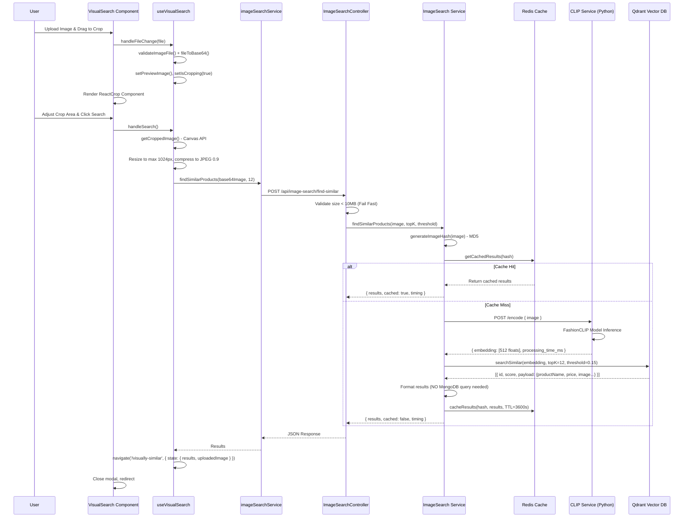

# Phân Tích Chi Tiết Tính Năng: Visual Search - Tìm Kiếm Bằng Hình Ảnh

### 1. Tổng Quan & Files Liên Quan

**Mục đích:** Cho phép người dùng tìm kiếm sản phẩm thời trang bằng cách upload hình ảnh, hỗ trợ crop vùng ảnh cụ thể. Sử dụng AI (FashionCLIP) để vector hóa ảnh và tìm sản phẩm tương đồng trong Qdrant Vector Database.

**Danh sách Files:**
* **Frontend UI:**
  * `client/src/features/products/components/VisualSearch/VisualSearch.tsx` - Modal upload & crop
  * `client/src/features/products/components/VisualSearch/VisualSearch.module.css` - Styles
* **Frontend Logic:**
  * `client/src/features/products/hooks/useVisualSearch.ts` - State & handlers
  * `client/src/features/products/api/imageSearchService.ts` - API calls
  * `client/src/shared/utils/imageUtils.ts` - Image processing utilities
* **Backend:**
  * `server/routes/imageSearchRoutes.js` - Routes
  * `server/controllers/ImageSearchController.js` - Controllers
  * `server/services/imageSearch.service.js` - Main orchestrator
  * `server/services/imageSearch/clipServiceClient.js` - CLIP API client
  * `server/services/imageSearch/qdrantVectorStore.js` - Qdrant client
  * `server/services/imageSearch/redisCache.js` - Redis caching
  * `server/validators/imageSearch.validator.js` - Zod validation
* **CLIP Service (Python):**
  * `clip-service/main.py` - FastAPI service
  * `clip-service/Dockerfile` - Container config
  * `clip-service/requirements.txt` - Dependencies

---

### 2. Kiến Trúc & Luồng Dữ Liệu

#### 2.1. Sơ đồ Tuần Tự



#### 2.2. Diễn Giải Chi Tiết

**1. User Interaction:**
* User click vào dropzone hoặc drag-drop file vào `VisualSearch.tsx` component
* Event `handleFileChange` hoặc `handleDrop` được trigger trong hook `useVisualSearch`

**2. File Validation & Preview:**
* Hook gọi `validateImageFile(file)` - Check type (jpeg/png/webp) và size (<10MB)
* Nếu valid: `fileToBase64(file)` convert sang base64 string
* Set state: `previewImage = base64`, `isCropping = true` → UI chuyển sang màn hình crop

**3. Crop Interface (react-image-crop):**
* `ReactCrop` component render với ảnh preview
* `handleImageLoad` tự động set initial crop (80% centered square)
* User drag/resize crop area → `setCrop()`, `setCompletedCrop()` update state

**4. Search Initiation:**
* User click "Search" button → `handleSearch()` được gọi
* `getCroppedImage()` sử dụng Canvas API:
  - Tính toán scale ratio (naturalWidth/displayWidth)
  - Draw cropped portion lên canvas
  - Resize nếu > 1024px (maintain aspect ratio)
  - Export `canvas.toDataURL('image/jpeg', 0.9)` → compressed base64

**5. API Request:**
* `findSimilarProducts(croppedImage, 12)` gọi `POST /api/image-search/find-similar`
* Request body: `{ image: "data:image/jpeg;base64...", topK: 12, scoreThreshold: 0.15 }`
* Timeout: 60 seconds (large upload)

**6. Backend Processing (Controller):**
* `ImageSearchController.findSimilarProductsSelfHost`:
  - Validate base64 length < 50MB (string length check for fail-fast)
  - Call `imageSearchService.findSimilarProducts()`
  - Catch errors và return appropriate status codes (400/503/500)

**7. Service Orchestration:**
* `imageSearchService.ensureInitialized()` - Ensure Qdrant & Redis connected
* **Step 1 - Cache Check:** 
  - `generateImageHash(image)` → MD5 hash từ first 5000 chars base64
  - `getCachedResults(hash)` query Redis với key `visual-search:{hash}`
  - Nếu hit: Return ngay (latency <10ms)
* **Step 2 - CLIP Encoding (nếu cache miss):**
  - `encodeImage(image)` gọi `http://localhost:8899/encode`
  - CLIP service (Python FastAPI):
    + Decode base64 → PIL Image
    + `CLIPProcessor` preprocess image
    + `CLIPModel.get_image_features()` inference
    + L2 normalize → 512-dim vector
  - Return `{ embedding: [512 floats], processing_time_ms }`
* **Step 3 - Vector Search:**
  - `searchSimilar(embedding, 12, 0.15)` query Qdrant
  - Qdrant sử dụng HNSW algorithm với Cosine distance
  - Filter results với `score_threshold >= 0.15`
  - Return top-12 matches với **full payload** (productName, price, images, slug...)
* **Step 4 - Format Results:**
  - Map Qdrant results thành frontend format
  - **Không cần query MongoDB** vì all data trong Qdrant payload
* **Step 5 - Cache Write:**
  - `cacheResults(hash, results, 3600)` async write to Redis
  - TTL = 1 hour

**8. Response & Navigation:**
* Controller trả JSON: `{ success: true, data: [...], count, cached, timing: {...} }`
* Frontend hook nhận response
* `navigate('/visually-similar', { state: { uploadedImage, results } })` 
* Modal close, trang kết quả hiển thị grid sản phẩm

---

### 3. Phân Tích Chi Tiết Frontend

#### 3.1. Hook - useVisualSearch (`hooks/useVisualSearch.ts`)

**States:**
```typescript
const [isDragging, setIsDragging] = useState(false);        // Drag-drop UI
const [isUploading, setIsUploading] = useState(false);      // Loading state
const [error, setError] = useState<string | null>(null);    // Error message
const [previewImage, setPreviewImage] = useState<string | null>(null); // Base64
const [isCropping, setIsCropping] = useState(false);        // Crop mode
const [crop, setCrop] = useState<Crop | undefined>();       // Current crop area
const [completedCrop, setCompletedCrop] = useState<Crop>(); // Final crop
```

**Key Functions:**

* **`handleFileSelect(file: File)`:**
  - Validate: `validateImageFile()` → return error string hoặc null
  - Convert: `fileToBase64(file)` → Promise<string>
  - Update state: `setPreviewImage()`, `setIsCropping(true)`

* **`handleImageLoad(e: SyntheticEvent<HTMLImageElement>)`:**
  - Get image dimensions: `e.currentTarget.width/height`
  - Calculate centered square crop (80% of min dimension)
  - Set initial crop state

* **`getCroppedImage()`:**
  - Call `getCroppedImageBase64(imgRef.current, completedCrop, previewImage)`
  - Image utils function:
    + Calculate scale: `scaleX = naturalWidth / displayWidth`
    + Crop coordinates: `cropX = crop.x * scaleX`
    + Draw on canvas: `ctx.drawImage(img, cropX, cropY, cropW, cropH, 0, 0, cropW, cropH)`
    + Resize if > 1024px: Create second canvas, scale down
    + Export: `canvas.toDataURL('image/jpeg', 0.9)`

* **`handleSearch()`:**
  - Set loading: `setIsUploading(true)`, `setIsCropping(false)`
  - Get cropped image
  - API call: `findSimilarProducts(imageToSearch, 12)`
  - Success: `navigate('/visually-similar', { state: {...} })`, `onClose()`
  - Error handling:
    + `error.message === 'Network Error'` → Network error message
    + `error.status === 503` → Service unavailable
    + `error.status === 413` → Image too large
    + Default → Generic search failed
  - Always: `setIsUploading(false)`

**Drag & Drop Handlers:**
- `handleDragEnter/Leave/Over`: Prevent default, update `isDragging` state
- `handleDrop`: Extract file from `e.dataTransfer.files[0]`, call `handleFileSelect()`

#### 3.2. UI Component (`VisualSearch.tsx`)

**Props:** `{ isOpen: boolean, onClose: () => void }`

**Render States:**
1. **Upload State** (`!isCropping && !isUploading`):
   - Dropzone with icon, text "Click to upload or Drag & Drop"
   - Supported formats: .jpeg, .png, .webp (Max 10MB)
   - CSS: `isDragging` class toggle for visual feedback

2. **Cropping State** (`isCropping && previewImage`):
   - `<ReactCrop>` component wrapping preview image
   - Crop instructions: "Drag to select the area you want to search"
   - Three buttons:
     + **Back**: Reset to upload state
     + **Change Image**: Re-open file picker
     + **Search**: Disabled until `completedCrop` exists

3. **Uploading State** (`isUploading`):
   - Preview image with opacity 0.3 background
   - Spinner animation (CSS keyframes)
   - Text: "Searching for similar products..."

**Error Display:**
- Render error div if `error !== null`
- Red background (#fee2e2), error text styling

**Performance:**
- `memo()` wrapper để avoid unnecessary re-renders
- DisplayName: `'VisualSearch'` for debugging

#### 3.3. API Service (`api/imageSearchService.ts`)

```typescript
export const findSimilarProducts = async (
  base64Image: string,
  topK = 12
): Promise<ImageSearchResult> => {
  const data = await apiClient.post<ImageSearchResult>(
    '/image-search/find-similar',
    { image: base64Image, topK },
    { timeout: 60000 }  // 60 seconds
  );
  return data as unknown as ImageSearchResult;
};
```

**Image Compression Logic:**
- Small files (<500KB): Direct base64 conversion
- Large files: Resize using Canvas API
  + Max dimension: 1024px
  + Maintain aspect ratio
  + Convert to JPEG quality 0.85

---

### 4. Giao Diện API Contract

**Endpoint:** `POST /api/image-search/find-similar`

**Request:**
```json
{
  "image": "data:image/jpeg;base64,/9j/4AAQSkZ...",
  "topK": 12,
  "scoreThreshold": 0.15
}
```

**Validation (Zod Schema):**
```javascript
{
  image: z.string().min(1),                    // Required
  topK: z.number().int().positive().default(12),
  scoreThreshold: z.number().positive().max(1).default(0.15)
}
```

**Response Success (200):**
```json
{
  "success": true,
  "data": [
    {
      "variantId": "abc123",
      "productId": "prod456",
      "productName": "Slim Fit Blazer",
      "color": "Navy Blue",
      "price": 1299000,
      "score": 0.87,
      "similarity": 87,
      "mainImage": "https://res.cloudinary.com/.../main.jpg",
      "hoverImage": "https://res.cloudinary.com/.../hover.jpg",
      "size": "L",
      "sku": "BLZ-NAV-L-001",
      "inStock": true,
      "urlSlug": "slim-fit-blazer-navy"
    }
  ],
  "count": 1,
  "cached": false,
  "timing": {
    "cacheCheck": 2,
    "clipEncode": 245,
    "qdrantSearch": 15,
    "total": 262
  }
}
```

**Response Errors:**
- `400`: Image validation failed (too large, invalid format)
- `503`: CLIP service or Qdrant unavailable
- `500`: Internal server error

---

### 5. Backend Chi Tiết

#### 5.1. CLIP Service (Python - `clip-service/main.py`)

**Model:** `patrickjohncyh/fashion-clip` (Zalando's FashionCLIP)
**Dimensions:** 512
**Framework:** FastAPI + Transformers + PyTorch

**Key Endpoints:**

1. **`POST /encode`** - Single image:
```python
@app.post("/encode")
async def encode_image(request: ImageRequest):
    image = decode_image(request.image)  # Base64 or URL
    inputs = processor(images=image, return_tensors="pt")
    image_features = model.get_image_features(**inputs)
    image_features = image_features / image_features.norm(dim=-1, keepdim=True)  # L2 normalize
    return { embedding: [...], processing_time_ms: 123 }
```

2. **`GET /health`** - Health check:
```python
return { status: "healthy", model: "FashionCLIP", dims: 512, device: "cpu" }
```

**Docker Setup:**
- Base: `python:3.11-slim`
- Port: 8899
- Health check: `curl -f http://localhost:8899/health`
- CMD: `uvicorn main:app --host 0.0.0.0 --port 8899`

#### 5.2. Qdrant Vector Store (`qdrantVectorStore.js`)

**Config:**
- URL: `process.env.QDRANT_URL || 'http://localhost:6333'`
- Collection: `'visual-search'`
- Vector size: 512
- Distance: Cosine

**Functions:**

* **`initQdrant()`:**
  - Create client: `new QdrantClient({ url, timeout: 5000 })`
  - Check collection exists: `getCollections()`
  - Create if not exists:
```javascript
await qdrantClient.createCollection(COLLECTION_NAME, {
  vectors: { size: 512, distance: 'Cosine' },
  optimizers_config: { indexing_threshold: 0 },
  on_disk_payload: true
});
```

* **`searchSimilar(queryVector, topK, scoreThreshold)`:**
```javascript
const results = await client.search(COLLECTION_NAME, {
  vector: queryVector,
  limit: topK,
  score_threshold: scoreThreshold,
  with_payload: true
});
return results.map(r => ({ id, score, similarity: score*100, ...r.payload }));
```

**Payload Structure trong Qdrant:**
```json
{
  "variantId": "...",
  "productId": "...",
  "productName": "...",
  "color": "...",
  "price": 1299000,
  "mainImage": "https://...",
  "hoverImage": "https://...",
  "size": "L",
  "sku": "...",
  "inStock": true,
  "urlSlug": "..."
}
```

#### 5.3. Redis Cache (`redisCache.js`)

**Config:**
- URL: `process.env.REDIS_URL || 'redis://localhost:6379'`
- Key prefix: `'visual-search:'`
- TTL: 3600s (1 hour)

**Functions:**

* **`generateImageHash(imageData)`:**
  - Use first 5000 chars of base64 (for performance)
  - MD5 hash: `crypto.createHash('md5').update(content).digest('hex')`

* **`getCachedResults(imageHash)`:**
  - Key: `visual-search:{hash}`
  - Parse JSON: `JSON.parse(cached)`
  - Log cache hit/miss

* **`cacheResults(hash, results, ttl)`:**
  - `setEx(key, ttl, JSON.stringify(results))`
  - Async operation (don't block response)

---

### 6. Edge Cases & Technical Notes

**Performance:**
- First search: 250-500ms (CLIP encode + Qdrant search)
- Cached search: <10ms
- Client-side resize critical để giảm upload time

**Availability:**
- CLIP service down → 503 error
- Qdrant down → 503 error với hint message
- Redis down → Continue without cache (slower repeat queries)

**Security:**
- Public API (no auth needed)
- Rate limiting via global middleware
- File size validation (max 10MB)

**Scalability:**
- CLIP service: CPU-based (có thể upgrade lên GPU)
- Qdrant: HNSW index scales to millions of vectors
- Redis: LRU eviction khi full memory

**Data Consistency:**
- Qdrant payload chứa denormalized product data
- Khi product update trong MongoDB → cần reindex Qdrant
- Trade-off: Fast reads vs eventual consistency

---

### 7. Debug & Testing Guide

**Logs Check:**
```bash
# Backend
npm run dev
# Look for:
# ✅ Qdrant collection exists: visual-search
# ✅ Redis connected
# 🔍 Encoding image via CLIP service...
# ✅ Found 12 similar products in 350ms

# CLIP Service
docker logs devenir-clip-service
# ✅ FashionCLIP loaded in 5.23s
```

**Health Check:**
```bash
curl http://localhost:5000/api/image-search/health
# Response:
{
  "healthy": true,
  "checks": {
    "clip": true,
    "qdrant": true,
    "redis": true
  }
}
```

**Test Cases:**

1. **Happy Path:**
   - Upload ảnh áo sơ mi xanh
   - Crop vùng áo
   - Expected: Return 12 áo sơ mi xanh tương tự, score > 0.15

2. **Cache Test:**
   - Upload same image twice
   - First: `cached: false`, timing ~300ms
   - Second: `cached: true`, timing <20ms

3. **Crop Accuracy:**
   - Upload ảnh full body (áo + quần + giày)
   - Crop only giày region
   - Expected: Return giày similar products (not áo/quần)

4. **Error Handling:**
   - Stop Qdrant: `docker stop devenir-qdrant`
   - Search → 503 with hint message
   - Upload 15MB file → 400 "Image too large"

5. **File Format:**
   - Test with JPEG, PNG, WebP → All work
   - Test with GIF → Validation error
