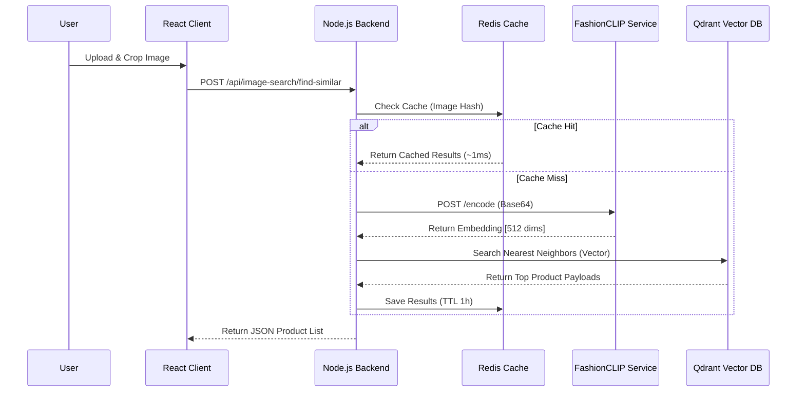

# Visual Search Feature Documentation
*Tài liệu kỹ thuật chi tiết cho tính năng tìm kiếm bằng hình ảnh trên nển tảng Devenir.*

---

## 1. Tổng quan & Kiến trúc

### Giới thiệu
Tính năng Visual Search cho phép người dùng tìm kiếm sản phẩm bằng cách tải lên hình ảnh. Hệ thống sử dụng AI để phân tích đặc trưng hình ảnh (màu sắc, kiểu dáng, họa tiết) và tìm ra các sản phẩm tương đồng nhất trong kho hàng.

### Sơ đồ Kiến trúc (High-Level Architecture)

Hệ thống được thiết kế theo kiến trúc Microservices để đảm bảo hiệu năng và khả năng mở rộng.



### Technology Stack

| Thành phần | Công nghệ | Vai trò & Lý do lựa chọn |
|:---|:---|:---|
| **AI Model** | **FashionCLIP** (Zalando) | Mô hình chuyên biệt cho thời trang, tốt hơn OpenAI CLIP gốc trong việc nhận diện thuộc tính chi tiết (váy midi, cổ V, màu be...). |
| **Vector DB** | **Qdrant** | Database lưu trữ vector hiệu năng cao (Rust). Hỗ trợ lưu trữ Payload đầy đủ, giúp **loại bỏ bước query phụ vào MongoDB**. |
| **Backend** | **Node.js** + Express | API Gateway điều phối luồng dữ liệu, validation và auth. |
| **Cache** | **Redis** | Caching lớp 1. Giảm tải tính toán AI cho các request lặp lại (user refresh, back/forward). |
| **Frontend** | **React** + `react-image-crop` | Xử lý ảnh client-side (crop, resize, compress) giúp giảm tải băng thông và server. |

---

## 2. Chi tiết Luồng Hoạt động (Data Flow)

### Bước 1: Client-Side Processing
Tại giao diện người dùng (`VisualSearch.tsx`):
1.  **Input**: User upload ảnh hoặc kéo thả.
2.  **Preprocessing**:
    *   **Cropping**: User khoanh vùng sản phẩm cần tìm (loại bỏ background nhiễu).
    *   **Compression**: Ảnh được resize về max 1024px, nén JPEG 85% để giảm payload size.
3.  **Request**: Gửi ảnh (Base64) lên API.

### Bước 2: Backend Orchestration
Upon receiving request tại `ImageSearchController.js`:
1.  **Validation**: Kiểm tra size (<10MB) và format.
2.  **Cache Check**: Hash ảnh input -> Kiểm tra Redis. Nếu có, trả về ngay lập tức.
3.  **Service Call**: Nếu chưa cache, gọi sang FashionCLIP Service.

### Bước 3: AI Inference (FashionCLIP)
Service độc lập (`clip-service`) chạy Python/FastAPI:
1.  **Input**: Ảnh Base64.
2.  **Model**: `patrickjohncyh/fashion-clip`.
3.  **Process**: Resize/Normalize -> Forward qua model.
4.  **Output**: Vector 512 chiều (Embedding).

### Bước 4: Similarity Search (Qdrant)
Backend dùng vector nhận được để truy vấn Qdrant:
1.  **Algorithm**: HNSW (Hierarchical Navigable Small World) cho tốc độ tìm kiếm cực nhanh (~5-10ms).
2.  **Filtering**: Lọc kết quả có độ tương đồng `score < threshold` (mặc định 0.15).
3.  **Payload**: Lấy thông tin sản phẩm trực tiếp từ Qdrant (Tên, Giá, Ảnh, Slug).

---

## 3. Thông số Kỹ thuật & Cấu hình Model

### Model Configuration
So sánh hiệu quả giữa FashionCLIP và Generic CLIP:

| Đặc điểm | OpenAI CLIP (ViT-L-14) | FashionCLIP (Self-hosted) |
|---|---|---|
| **Training Data** | Ảnh tạp (General objects) | **800K+ Ảnh thời trang** |
| **Model Size** | ~850MB | **~400MB** (Nhẹ hơn) |
| **Inference Time** | ~400ms | **~200ms** (Nhanh hơn 2x) |
| **Color Accuracy** | Thấp (Top 5-6) | **Cao** (Top 1) |
| **Fashion Attributes** | Trung bình | **Rất tốt** (Hiểu style, chất liệu) |

### API Endpoints

**1. Find Similar Products**
*   `POST /api/image-search/find-similar`
*   **Request**:
    ```json
    {
        "image": "data:image/jpeg;base64,.....",
        "topK": 12,
        "scoreThreshold": 0.15
    }
    ```
*   **Response**:
    ```json
    {
        "success": true,
        "data": [
            {
                "productName": "EKD Wool Sweater",
                "price": 450,
                "score": 0.61, // Độ tương đồng 61%
                "image": "https://..."
            }
        ],
        "timing": { "total": 210, "clipEncode": 200, "qdrantSearch": 6 }
    }
    ```

---

## 4. Hiệu năng (Performance)

Hệ thống được tối ưu hóa cho tốc độ phản hồi nhanh (Low Latency).

| Loại Request | Thời gian xử lý | Ghi chú |
|---|---|---|
| **Cold Request** (Lần đầu) | 150ms - 250ms | Bao gồm: Upload + Encode + Search |
| **Warm Request** (Cached) | **~1ms - 5ms** | Trả về trực tiếp từ Redis |

**Bảng phân tích thời gian (Timing Breakdown)**:
*   Cache Check: **~1ms**
*   AI Inference (Encode): **~100-200ms** (Phụ thuộc CPU/GPU)
*   Vector Search (Qdrant): **~5-10ms** (Với 10k+ sản phẩm)

---

## 5. Cấu trúc Source Code

### 📁 Docker Services
*   `docker-compose.visual-search.yml`: Định nghĩa stack (Qdrant, Redis, CLIP Service).
*   `clip-service/`: Source code Python API cho model AI.

### 📁 Server (Node.js)
*   `services/imageSearch/clipServiceClient.js`: Client giao tiếp với AI Service.
*   `services/imageSearch/qdrantVectorStore.js`: Client giao tiếp Qdrant.
*   `services/imageSearch/redisCache.js`: Client xử lý caching.
*   `scripts/ingestion/ingest-to-qdrant.js`: Script đồng bộ dữ liệu từ DB sang Vector DB.

### 📁 Client (React)
*   `components/VisualSearch/VisualSearch.tsx`: UI Upload & Crop.
*   `hooks/useVisualSearch.ts`: Logic xử lý state và API calls.

---

## 6. Hướng dẫn Vận hành (Operational Guide)

### Các lệnh quan trọng

```bash
# 1. Khởi động hệ thống Visual Search (Docker)
docker compose -f docker-compose.visual-search.yml up -d

# 2. Xem logs dịch vụ AI
docker compose -f docker-compose.visual-search.yml logs -f clip-service

# 3. Đồng bộ dữ liệu vào Qdrant (Chạy khi có sản phẩm mới)
cd server && node scripts/ingestion/ingest-to-qdrant.js --force

# 4. Xóa Cache (Chạy khi update model)
docker exec devenir-redis redis-cli FLUSHDB
```

### Xử lý sự cố (Troubleshooting)
1.  **AI Service bị chậm?** -> Kiểm tra CPU usage hoặc cân nhắc bật GPU acceleration trong `docker-compose`.
2.  **Kết quả tìm kiếm không chính xác?** -> Kiểm tra bước crop ảnh ở client, đảm bảo user không lấy quá nhiều background nhiễu.
3.  **Lỗi connection?** -> Đảm bảo các port 6333 (Qdrant), 6379 (Redis), 8899 (CLIP) không bị chặn firewall.
