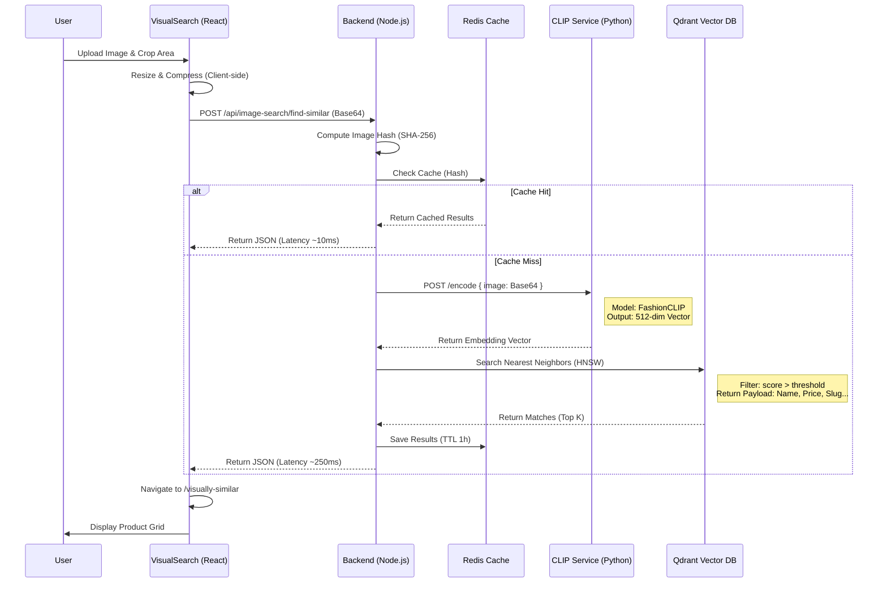

# Phân Tích Chi Tiết Tính Năng: [Visual Search - Tìm Kiếm Bằng Hình Ảnh]

### 1. Tổng Quan & Files Liên Quan
*   **Mục đích:** Cho phép người dùng tìm kiếm sản phẩm thời trang bằng cách upload hình ảnh hoặc crop một vùng ảnh. Hệ thống sử dụng AI (FashionCLIP) để phân tích đặc trưng thị giác và tìm sản phẩm tương đồng trong kho dữ liệu vector (Qdrant).
*   **Danh sách Files tham gia:**
    *   **Frontend UI:**
        *   `client/src/features/products/components/VisualSearch/VisualSearch.tsx`: Giao diện chính (Modal upload & crop).
    *   **Frontend Logic:**
        *   `client/src/features/products/hooks/useVisualSearch.ts`: Hook quản lý logic upload, crop và gọi API.
        *   `client/src/features/products/api/imageSearchService.ts`: API Client.
        *   `client/src/shared/utils/imageUtils.ts`: Các hàm utility xử lý ảnh (resize, compress, base64).
    *   **Backend Route/Controller:**
        *   `server/routes/imageSearchRoutes.js`: Định nghĩa API endpoints.
        *   `server/controllers/ImageSearchController.js`: Validate request và điều phối logic.
    *   **Backend Logic/Service:**
        *   `server/services/imageSearch.service.js`: Service chính, orchestrator.
        *   `server/services/imageSearch/clipServiceClient.js`: Client giao tiếp với CLIP Service (Python/FastAPI).
        *   `server/services/imageSearch/qdrantVectorStore.js`: Client giao tiếp với Qdrant Vector DB.
        *   `server/services/imageSearch/redisCache.js`: Caching layer.

### 2. Kiến Trúc & Luồng Dữ Liệu (Data Flow)
*   **Sơ đồ Mermaid Sequence Chi Tiết:**



### 3. Phân Tích Chi Tiết Frontend (Client-Side)

#### 3.1. Hook & Logic (`src/features/products/hooks/useVisualSearch.ts`)
*   **`useVisualSearch(isOpen, onClose)`**:
    *   **Mục đích:** Quản lý toàn bộ vòng đời của việc tìm kiếm ảnh.
    *   **State nội bộ:**
        *   `previewImage` (string | null): Base64 của ảnh gốc user upload.
        *   `crop`, `completedCrop` (Crop type): Tọa độ vùng crop user chọn.
        *   `isCropping` (boolean): Trạng thái đang crop hay đang xem kết quả/upload.
        *   `isUploading` (boolean): Loading state khi gọi API.
    *   **Helper Functions:**
        *   `getCroppedImage()`: Cắt ảnh từ `imgRef` dựa trên `completedCrop`, vẽ lên Canvas ẩn và export ra Base64.
        *   `handleFileSelect(file)`: Validate file (type, size), convert sang base64, set state để hiện màn hình crop.
    *   **Exposed Handlers:**
        *   `handleSearch()`: 
            1. Gọi `getCroppedImage()` để lấy ảnh final.
            2. Gọi API `findSimilarProducts(image)`.
            3. Nếu thành công: Navigate sang trang kết quả `/visually-similar` kèm data `state` (không dùng URL params vì payload lớn).
            4. Nếu lỗi: Set `error` state (xử lý các mã lỗi 413, 503...).

#### 3.2. UI Components & Interaction (`VisualSearch.tsx`)
*   **Thư viện:** Sử dụng `react-image-crop` để cung cấp giao diện crop ảnh chuyên nghiệp.
*   **Render Logic:**
    *   **State 1 (Upload):** Hiển thị Dropzone.
    *   **State 2 (Cropping):** Hiển thị `ReactCrop` component bao lấy ảnh preview.
    *   **State 3 (Loading):** Hiển thị Spinner khi đang gọi API.
*   **Performance:** Sử dụng `memo` để tránh re-render không cần thiết khi parent component thay đổi.

#### 3.3. API Layer (`src/features/products/api/imageSearchService.ts`)
*   **`findSimilarProducts(image, topK = 12)`**:
    *   Gửi POST request tới `/image-search/find-similar`.
    *   Payload: `{ image: "data:image/jpeg...", topK: 12 }`.

### 4. Giao Diện API (Contract)

*   **Endpoint:** `POST /api/image-search/find-similar`
*   **Headers:** `Content-Type: application/json`
*   **Request Body:**
    ```json
    {
      "image": "data:image/jpeg;base64,/9j/4AAQSkZJRg...", // Base64 string (Max 10MB)
      "topK": 12,           // Số lượng kết quả muốn lấy (Default: 12)
      "scoreThreshold": 0.15 // Độ tương đồng tối thiểu (0.0 - 1.0, Default: 0.15)
    }
    ```
*   **Response Success (200):**
    ```json
    {
      "success": true,
      "data": [
        {
          "productId": "65cb...",
          "productName": "Striped Cotton Shirt",
          "price": 599000,
          "score": 0.89,       // Độ tương đồng (Càng cao càng giống)
          "mainImage": "https://...",
          "urlSlug": "striped-cotton-shirt"
        }
      ],
      "count": 1,
      "cached": false,         // True nếu lấy từ Redis
      "timing": {
        "total": 350,
        "clipEncode": 200,
        "qdrantSearch": 10
      }
    }
    ```
*   **Response Error:**
    *   `400 Bad Request`: Image too large (>10MB) hoặc invalid format.
    *   `503 Service Unavailable`: Qdrant hoặc CLIP service bị down.

### 5. Phân Tích Chi Tiết Backend (Server-Side)

#### 5.1. Controller Layer (`server/controllers/ImageSearchController.js`)
*   **`findSimilarProductsSelfHost`**:
    *   **Validation:** Kiểm tra nhanh kích thước Base64 string. Nếu > 10MB -> Reject ngay lập tức (Fail Fast).
    *   **Flow:** Gọi `imageSearchService.findSimilarProducts(image)`.
    *   **Error Handling:** Catch lỗi `Service Unavailable` để gợi ý Admin restart Docker container.

#### 5.2. Service Layer (`server/services/imageSearch.service.js`)
Đây là Orchestrator Service, điều phối toàn bộ flow.

*   **Logic xử lý (Step-by-step):**
    1.  **Init Check:** Đảm bảo connection tới Qdrant và Redis đã sẵn sàng (`ensureInitialized`).
    2.  **Cache Check (Redis):**
        *   Tạo hash SHA-256 từ chuỗi Base64 ảnh input.
        *   Query Redis với key `img_search:${hash}`.
        *   Nếu có -> Trả về ngay (Latency < 10ms).
    3.  **Vector Encoding (CLIP Service):**
        *   Gọi sang container `clip-service` (Port 8899).
        *   Input: Ảnh Base64.
        *   Output: Vector 512 chiều (Embedding).
        *   Model: `patrickjohncyh/fashion-clip`.
    4.  **Similarity Search (Qdrant):**
        *   Gửi vector vừa tạo vào Qdrant Collection `clothing_products`.
        *   Query tìm `topK` vector gần nhất (dùng thuật toán HNSW/Cosine Similarity).
        *   Filter: Loại bỏ các kết quả có `score < scoreThreshold`.
    5.  **Payload Extraction:**
        *   *Điểm đặc biệt:* Hệ thống lưu toàn bộ thông tin hiển thị (Name, Price, Slug, Image) ngay trong Payload của Qdrant.
        *   -> **Không cần query ngược lại MongoDB**, giúp giảm 1 round-trip database và tăng tốc độ.
    6.  **Caching:** Lưu kết quả vào Redis với TTL (Time-To-Live) mặc định 1 giờ.

### 6. Các Vấn Đề Kỹ Thuật (Edge Cases & Performance)

*   **Performance (Cold Start):** Lần search đầu tiên sẽ chậm hơn (~300-500ms) do phải encode ảnh và search vector. Các lần sau nếu ảnh trùng lặp sẽ cực nhanh nhờ Redis.
*   **Qdrant Availability:** Nếu Qdrant chết, search sẽ fail toàn bộ. Service có cơ chế health check (`/api/image-search/health`) để monitor.
*   **Image Pre-processing:** Client thực hiện resize ảnh về max 1024px trước khi gửi. Điều này cực kỳ quan trọng để giảm bandwidth upload và giảm tải cho CLIP Service.
*   **Security:** API là Public (để khách hàng dùng), nhưng có Rate Limiting (thông qua `express-rate-limit` ở tầng `app.js` - Global Middleware) để tránh spam request làm quá tải GPU/CPU server.

### 7. Hướng Dẫn Debug & Kiểm Thử
*   **Logs:**
    *   Backend log (`npm run dev`): Tìm keyword `[ImageSearchService]`, `Encoding image via CLIP...`.
    *   Kiểm tra thời gian xử lý: Response JSON trả về object `timing` chi tiết từng bước.
*   **Check Services:**
    *   Gọi `GET /api/image-search/health` để xem trạng thái CLIP, Qdrant, Redis.
*   **Test Case:**
    1.  **Case 1 (Standard):** Upload ảnh áo thun đỏ -> Kết quả trả về các áo thun đỏ tương tự.
    2.  **Case 2 (Cache):** Upload lại ảnh vừa rồi -> Response `cached: true`, `timing.total` giảm xuống < 20ms.
    3.  **Case 3 (Crop):** Upload ảnh cả người, crop lấy phần giày -> Kết quả trả về giày tương tự (chứng tỏ crop hoạt động đúng).
    4.  **Case 4 (System Down):** Stop container `devenir-qdrant` -> Search -> Nhận lỗi 503 kèm hướng dẫn fix.
