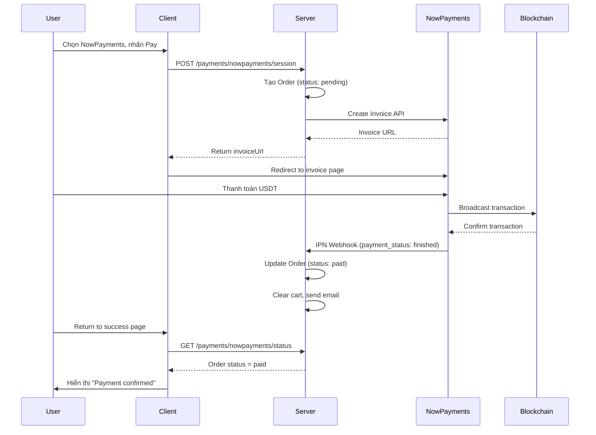

# NowPayments Integration Workflow

Tài liệu này mô tả chi tiết các bước cần thực hiện để áp dụng thanh toán NowPayments (USDT BSC) vào dự án. NowPayments cho phép khách hàng thanh toán bằng cryptocurrency (USDT trên BSC network).

---

## 1. Đăng ký tài khoản NowPayments

1. Truy cập [NowPayments.io](https://nowpayments.io/)
2. Đăng ký tài khoản business
3. Hoàn thành KYC verification (nếu yêu cầu)
4. Vào **Settings > API Keys** để lấy:
   - `API Key` - dùng để gọi API
   - `IPN Secret` - dùng để verify webhook callbacks
5. Cấu hình **IPN Callback URL** trong dashboard:
   ```
   https://your-domain.com/api/payments/nowpayments/webhook
   ```

---

## 2. Cấu hình Environment Variables

### Server (.env)

Thêm các biến môi trường sau vào file `.env` của server:

```bash
# NowPayments Configuration
NOWPAYMENTS_API_KEY=your_api_key_here
NOWPAYMENTS_IPN_SECRET=your_ipn_secret_here
NOWPAYMENTS_SANDBOX=false  # Set to 'true' for testing

# Required URLs
SERVER_URL=https://your-server-domain.com
CLIENT_URL=https://your-client-domain.com
```

> **Note**: Đặt `NOWPAYMENTS_SANDBOX=true` khi test trên sandbox environment.

---

## 3. Cấu trúc Files

### 3.1 Server-side Files

| File | Mô tả |
|------|-------|
| `server/services/nowpayments/nowpaymentsClient.js` | API client để giao tiếp với NowPayments |
| `server/controllers/PaymentController.js` | Controller xử lý payment logic |
| `server/routes/paymentRoutes.js` | Định nghĩa routes cho payment |

### 3.2 Client-side Files

| File | Mô tả |
|------|-------|
| `client/src/features/nowpayments/api.js` | API functions gọi server |
| `client/src/features/nowpayments/index.js` | Export module |
| `client/src/pages/NowPayments/NowPaymentsResult.jsx` | Trang hiển thị kết quả thanh toán |
| `client/src/pages/Checkout/Shipping.jsx` | Xử lý luồng checkout |
| `client/src/pages/Checkout/PaymentOptions.jsx` | Component chọn phương thức thanh toán |

---

## 4. Server Implementation

### 4.1 NowPayments API Client

Tạo file `server/services/nowpayments/nowpaymentsClient.js`:

```javascript
import crypto from 'crypto';

const getApiUrl = () => process.env.NOWPAYMENTS_SANDBOX === 'true'
    ? 'https://api-sandbox.nowpayments.io/v1'
    : 'https://api.nowpayments.io/v1';

const getApiKey = () => process.env.NOWPAYMENTS_API_KEY || '';
const getIpnSecret = () => process.env.NOWPAYMENTS_IPN_SECRET || '';

// Make API request
const makeRequest = async (endpoint, options = {}) => {
    const apiUrl = getApiUrl();
    const apiKey = getApiKey();
    const url = `${apiUrl}${endpoint}`;

    const response = await fetch(url, {
        ...options,
        headers: {
            'x-api-key': apiKey,
            'Content-Type': 'application/json',
            ...options.headers,
        },
    });

    const data = await response.json();
    if (!response.ok) {
        throw new Error(data.message || `NowPayments API error: ${response.status}`);
    }
    return data;
};

// Create invoice for payment
export const createInvoice = async (params) => {
    return makeRequest('/invoice', {
        method: 'POST',
        body: JSON.stringify({
            price_amount: params.price_amount,
            price_currency: params.price_currency || 'usd',
            pay_currency: params.pay_currency || 'usdtbsc',
            order_id: params.order_id,
            order_description: params.order_description,
            ipn_callback_url: params.ipn_callback_url,
            success_url: params.success_url,
            cancel_url: params.cancel_url,
        }),
    });
};

// Verify IPN callback signature
export const verifyIPN = (payload, signature) => {
    const ipnSecret = getIpnSecret();
    if (!ipnSecret) throw new Error('IPN secret not configured');

    const sortedPayload = Object.keys(payload)
        .sort()
        .reduce((acc, key) => {
            acc[key] = payload[key];
            return acc;
        }, {});

    const hmac = crypto
        .createHmac('sha512', ipnSecret)
        .update(JSON.stringify(sortedPayload))
        .digest('hex');

    return hmac === signature;
};

export default { createInvoice, verifyIPN };
```

### 4.2 Payment Controller Functions

Thêm vào `server/controllers/PaymentController.js`:

```javascript
import nowpaymentsClient from '../services/nowpayments/nowpaymentsClient.js';

// Create NowPayments invoice
export const createNowPaymentsInvoice = asyncHandler(async (req, res) => {
    const { shippingMethod, deliveryTime, address, giftCode } = req.body;
    
    // Validate inputs, build order, calculate total...
    
    // Create order in database
    const orderDoc = await Order.create({
        user: userId,
        orderItems,
        shippingAddress,
        paymentMethod: 'Crypto',
        paymentGateway: 'NowPayments',
        totalPrice: finalPrice,
        status: 'pending',
    });

    // Create NowPayments invoice
    const invoice = await nowpaymentsClient.createInvoice({
        price_amount: finalPrice,
        price_currency: 'usd',
        pay_currency: 'usdtbsc',
        order_id: String(orderDoc._id),
        order_description: `Order #${gatewayOrderCode}`,
        ipn_callback_url: `${serverBaseUrl}/api/payments/nowpayments/webhook`,
        success_url: `${clientBaseUrl}/checkout/nowpayments/success?orderId=${orderDoc._id}`,
        cancel_url: `${clientBaseUrl}/shipping?payment=cancelled`,
    });

    // Return invoice URL to client
    return res.status(201).json({
        success: true,
        data: { invoiceUrl: invoice.invoice_url, invoiceId: invoice.id }
    });
});

// Handle IPN webhook from NowPayments
export const handleNowPaymentsWebhook = asyncHandler(async (req, res) => {
    const signature = req.headers['x-nowpayments-sig'];
    
    // Verify signature
    if (signature) {
        const isValid = nowpaymentsClient.verifyIPN(req.body, signature);
        if (!isValid) return res.status(200).json({ success: true });
    }

    const { order_id, payment_status } = req.body;
    const order = await Order.findById(order_id);

    if (payment_status === 'finished' || payment_status === 'confirmed') {
        await order.markAsPaid({ ... });
        // Clear cart, send email...
    }

    return res.status(200).json({ success: true });
});

// Get payment status
export const getNowPaymentsStatus = asyncHandler(async (req, res) => {
    const { orderId } = req.params;
    const order = await Order.findById(orderId);
    return res.status(200).json({ success: true, data: order });
});
```

### 4.3 Payment Routes

Thêm vào `server/routes/paymentRoutes.js`:

```javascript
import { 
    createNowPaymentsInvoice, 
    handleNowPaymentsWebhook, 
    getNowPaymentsStatus 
} from '../controllers/PaymentController.js';

// NowPayments routes
router.post('/nowpayments/session', authenticate, createNowPaymentsInvoice);
router.get('/nowpayments/status/:orderId', authenticate, getNowPaymentsStatus);
router.post('/nowpayments/webhook', handleNowPaymentsWebhook);  // No auth!
```

> **Important**: Webhook endpoint KHÔNG cần authentication vì NowPayments gọi trực tiếp.

---

## 5. Client Implementation

### 5.1 API Functions

Tạo `client/src/features/nowpayments/api.js`:

```javascript
import apiClient from '../../services/api';

export const createNowPaymentsSession = async (payload) => {
    const response = await apiClient.post('/payments/nowpayments/session', payload);
    return response;
};

export const fetchNowPaymentsStatus = async (orderId) => {
    const response = await apiClient.get(`/payments/nowpayments/status/${orderId}`);
    return response;
};
```

### 5.2 Checkout Flow

Trong `Shipping.jsx`, xử lý payment:

```javascript
import { createNowPaymentsSession } from "../../features/nowpayments";

const handlePayWithNowPayments = async () => {
    const response = await createNowPaymentsSession({
        shippingMethod,
        deliveryTime,
        address: addressData,
        giftCode: appliedGiftCode || undefined,
    });

    if (response?.success && response?.data?.invoiceUrl) {
        window.location.href = response.data.invoiceUrl;
    }
};
```

### 5.3 Result Page

Tạo `NowPaymentsResult.jsx` để hiển thị kết quả thanh toán:
- Poll status từ server
- Hiển thị trạng thái: pending, success, failed
- Redirect về homepage sau khi thành công

### 5.4 Add Route

Trong `App.jsx`:

```jsx
import NowPaymentsResult from './pages/NowPayments/NowPaymentsResult.jsx';

<Route path="/checkout/nowpayments/success" element={<NowPaymentsResult />} />
```

---

## 6. Payment Flow Diagram



---

## 7. Payment Statuses

| NowPayments Status | Mô tả | Hành động |
|-------------------|-------|-----------|
| `waiting` | Đang chờ payment | Không làm gì |
| `confirming` | Đang confirm trên blockchain | Không làm gì |
| `confirmed` | Đã confirm | Mark order as paid |
| `finished` | Hoàn thành | Mark order as paid |
| `partially_paid` | Thanh toán thiếu | Log warning |
| `failed` | Thất bại | Mark as failed |
| `expired` | Hết hạn | Mark as failed |

---

## 8. Testing

### 8.1 Sandbox Mode

1. Set `NOWPAYMENTS_SANDBOX=true` trong `.env`
2. Sử dụng sandbox API key từ NowPayments dashboard
3. Test payment flow mà không cần crypto thật

### 8.2 Test Webhook Locally

Sử dụng ngrok để expose local server:

```bash
ngrok http 3111
```

Cập nhật IPN callback URL trong NowPayments dashboard thành ngrok URL.

### 8.3 Manual Testing Steps

1. Thêm sản phẩm vào giỏ hàng
2. Vào trang Shipping
3. Chọn delivery method và điền address
4. Chọn "NowPayments" payment option
5. Nhấn "Pay" → Redirect đến NowPayments
6. Hoàn thành thanh toán (sandbox)
7. Kiểm tra webhook được gọi
8. Verify order status = paid trong database

---

## 9. Troubleshooting

### API Key Invalid

```
Error: Invalid API Key
```

**Giải pháp**: Kiểm tra `NOWPAYMENTS_API_KEY` trong `.env` và restart server.

### Webhook Not Received

**Kiểm tra**:
1. IPN URL đã cấu hình đúng trong NowPayments dashboard
2. Server có thể được access từ internet
3. Endpoint trả về status 200

### Signature Verification Failed

**Giải pháp**: Kiểm tra `NOWPAYMENTS_IPN_SECRET` khớp với dashboard.

---

## 10. Security Checklist

- [ ] API Key được lưu trong environment variables, không hardcode
- [ ] IPN Secret được cấu hình và verify mọi webhook
- [ ] Webhook endpoint luôn trả về 200 để tránh retry spam
- [ ] Order được tạo trước khi redirect sang NowPayments
- [ ] Verify payment status từ server, không trust client-side data
- [ ] Log đầy đủ cho debugging
