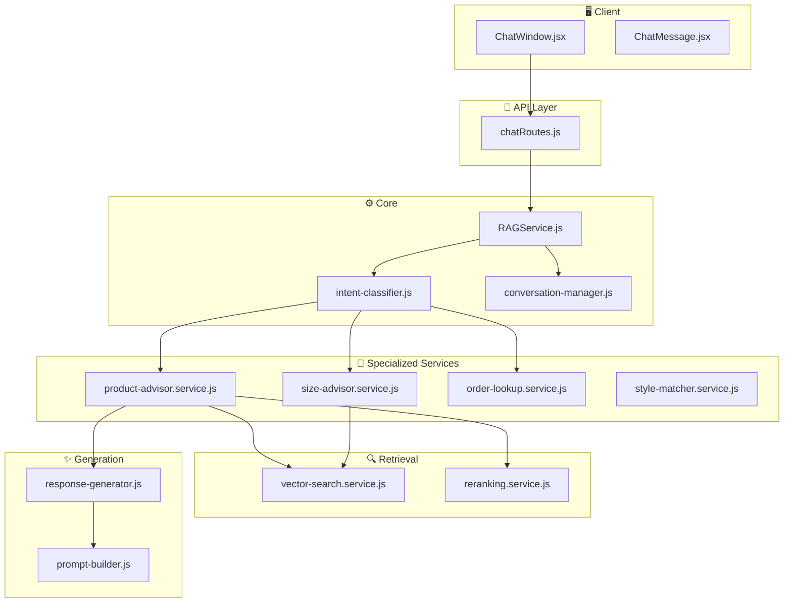

# RAG System Workflow - Devenir Fashion AI

Tài liệu này mô tả chi tiết workflow của hệ thống RAG (Retrieval-Augmented Generation) để tư vấn sản phẩm, size và hỗ trợ khách hàng.

## Kiến trúc Tổng quan



---

## Luồng xử lý chi tiết

### 1️⃣ User gửi tin nhắn

```
User: "tìm áo polo màu trắng"
     ↓
ChatWindow.jsx → POST /api/chat
     ↓
chatRoutes.js → RAGService.chat()
```

### 2️⃣ Phân loại Intent

```javascript
// intent-classifier.js
Intent types:
- "product_advice"  → Tư vấn sản phẩm
- "size_recommendation" → Tư vấn size
- "order_lookup"    → Tra cứu đơn hàng
- "style_matching"  → Phối đồ
- "general"         → Câu hỏi chung
```

### 3️⃣ Route đến Service phù hợp

```javascript
// RAGService.js
switch (intent) {
    case 'product_advice':
        → productAdvice()
    case 'size_recommendation':
        → sizeRecommendation()
    case 'order_lookup':
        → orderLookup()
}
```

---

## Chi tiết từng File

### 📁 **core/**

| File | Tác dụng |
|------|----------|
| [RAGService.js](file:///Users/nguyenlehuy/Downloads/devenir/server/services/rag/core/RAGService.js) | Entry point chính - điều phối toàn bộ flow |
| [VectorStore.js](file:///Users/nguyenlehuy/Downloads/devenir/server/services/rag/core/VectorStore.js) | Kết nối Pinecone vector database |
| [LLMProvider.js](file:///Users/nguyenlehuy/Downloads/devenir/server/services/rag/core/LLMProvider.js) | Wrapper cho OpenAI API |

---

### 📁 **orchestrators/**

| File | Tác dụng |
|------|----------|
| [intent-classifier.js](file:///Users/nguyenlehuy/Downloads/devenir/server/services/rag/orchestrators/intent-classifier.js) | Phân loại ý định user bằng LLM + keyword fallback |
| [conversation-manager.js](file:///Users/nguyenlehuy/Downloads/devenir/server/services/rag/orchestrators/conversation-manager.js) | Quản lý context hội thoại, lưu ChatLog vào MongoDB |

---

### 📁 **specialized/**

| File | Tác dụng |
|------|----------|
| [product-advisor.service.js](file:///Users/nguyenlehuy/Downloads/devenir/server/services/rag/specialized/product-advisor.service.js) | Tư vấn sản phẩm: Vector search → Rerank → Generate response |
| [size-advisor.service.js](file:///Users/nguyenlehuy/Downloads/devenir/server/services/rag/specialized/size-advisor.service.js) | Tư vấn size dựa trên chiều cao/cân nặng + bảng size |
| [order-lookup.service.js](file:///Users/nguyenlehuy/Downloads/devenir/server/services/rag/specialized/order-lookup.service.js) | Tra cứu đơn hàng cho user đã login |
| [style-matcher.service.js](file:///Users/nguyenlehuy/Downloads/devenir/server/services/rag/specialized/style-matcher.service.js) | Gợi ý phối đồ theo style/dịp |

---

### 📁 **retrieval/**

| File | Tác dụng |
|------|----------|
| [vector-search.service.js](file:///Users/nguyenlehuy/Downloads/devenir/server/services/rag/retrieval/vector-search.service.js) | Tìm kiếm sản phẩm bằng vector similarity (Pinecone) |
| [reranking.service.js](file:///Users/nguyenlehuy/Downloads/devenir/server/services/rag/retrieval/reranking.service.js) | Sắp xếp lại kết quả theo độ liên quan (Cohere Rerank) |

---

### 📁 **generation/**

| File | Tác dụng |
|------|----------|
| [prompt-builder.js](file:///Users/nguyenlehuy/Downloads/devenir/server/services/rag/generation/prompt-builder.js) | Xây dựng prompt cho LLM theo từng use case |
| [response-generator.js](file:///Users/nguyenlehuy/Downloads/devenir/server/services/rag/generation/response-generator.js) | Gọi OpenAI để generate câu trả lời tự nhiên |

---

### 📁 **embeddings/**

| File | Tác dụng |
|------|----------|
| [embedding.service.js](file:///Users/nguyenlehuy/Downloads/devenir/server/services/rag/embeddings/embedding.service.js) | Tạo vector embeddings từ text (OpenAI) |
| [proposition.service.js](file:///Users/nguyenlehuy/Downloads/devenir/server/services/rag/embeddings/proposition.service.js) | Chia nhỏ product info thành propositions để indexing |

---

## Ví dụ Flow: Tư vấn Size

```
User: "size M có vừa không, cao 1m70 nặng 65kg"
                    ↓
1. intent-classifier → "size_recommendation"
                    ↓
2. RAGService routes → sizeRecommendation()
                    ↓
3. size-advisor:
   - Tìm product từ context
   - Lấy variants có sẵn
   - Gọi LLM với bảng size
   - Trả về recommended_size + suggested_action
                    ↓
4. Response với nút "Có, thêm vào giỏ" / "Không, cảm ơn"
```

---

## Client-side Flow

```
ChatWindow.jsx
    ↓ handleSendMessage()
    ↓ sendChatMessage() → API
    ↓ Receive response với suggested_action
    ↓
ChatMessage.jsx
    ↓ Render action buttons
    ↓ handleYesClick() → useAddToCart()
    ↓ Update giỏ hàng
```
